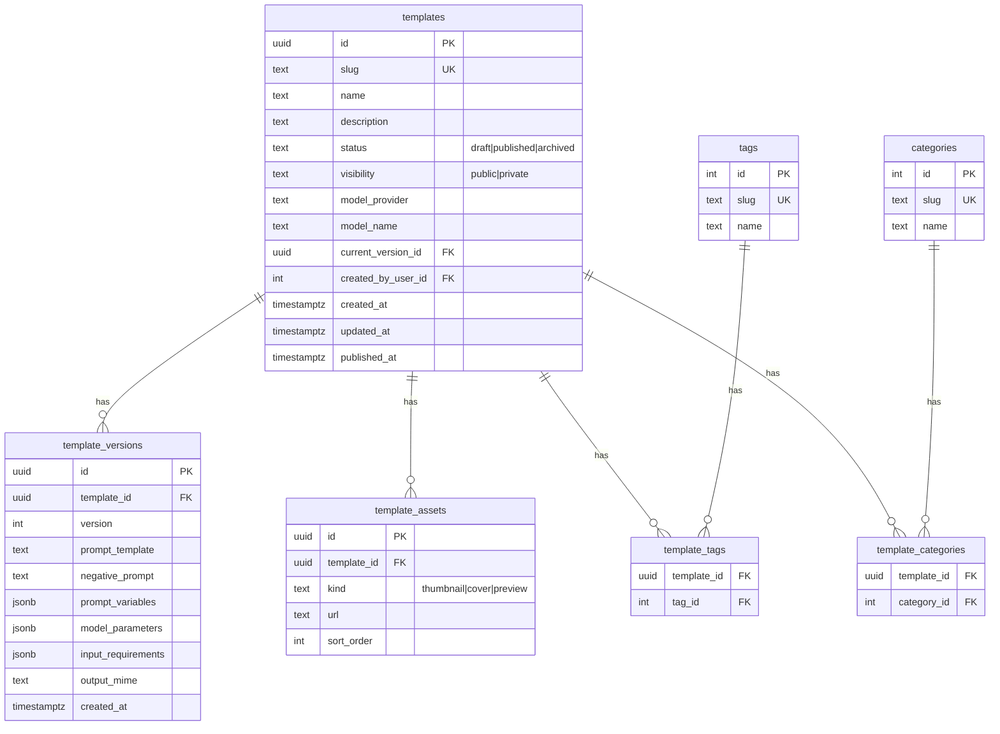

# Data Model — Templates (PostgreSQL)

Trạng thái: Draft  
Phiên bản: 1.0  
Cập nhật: 2025-10-20

Tài liệu này chuẩn hoá lưu trữ Template AI trên Postgres, thay thế việc đọc `backend/templates.json` trực tiếp trong runtime. Mục tiêu: mở rộng, versioning, tagging, publish flow, và bảo mật prompt/params trên server.

Lưu ý:
- Client (iOS) không nhận prompt/params thô; toàn bộ logic ghép biến và gọi AI provider thực thi server-side.
- Áp dụng tiêu chuẩn API envelope và không lộ vendor/third-party ra UI.

---

## 1) Mục tiêu & yêu cầu

- Quản lý Templates với trạng thái (draft|published|archived) và visibility (public|private).
- Versioning cho prompt/model parameters (immutable theo thời gian).
- Gắn thẻ (tags) và phân loại (categories) để lọc/browse.
- Lưu asset (thumbnail/cover/preview) theo template.
- Chuẩn bị cho i18n, favorites, statistics, A/B testing (mở rộng sau).
- Backward-compatible: có thể seed dữ liệu từ `backend/templates.json` sang DB.

---

## 2) ERD (Mermaid)



Ghi chú:
- `templates.current_version_id` trỏ tới version hiện tại (FK thêm sau khi tạo bảng `template_versions` để tránh vòng tham chiếu).
- `template_versions` immutable; thay đổi prompt/params => tạo version mới.

---

## 3) Định nghĩa bảng (DDL — PostgreSQL)

Khuyến nghị tạo 2 migration:

1) `0004_create_templates_and_versions.up.sql`  
Tạo `templates`, `template_versions`, và thêm FK `current_version_id`.

```sql
-- 0004_create_templates_and_versions.up.sql
CREATE EXTENSION IF NOT EXISTS "uuid-ossp";

-- Tạo bảng templates trước, có cột current_version_id nhưng CHƯA thêm FK
CREATE TABLE IF NOT EXISTS templates (
  id UUID PRIMARY KEY DEFAULT uuid_generate_v4(),
  slug TEXT NOT NULL UNIQUE,
  name TEXT NOT NULL,
  description TEXT,
  status TEXT NOT NULL DEFAULT 'draft' CHECK (status IN ('draft','published','archived')),
  visibility TEXT NOT NULL DEFAULT 'public' CHECK (visibility IN ('public','private')),
  model_provider TEXT NOT NULL DEFAULT 'gemini',            -- provider hiện tại, mở rộng sau
  model_name TEXT NOT NULL DEFAULT 'gemini-1.5-pro',        -- model mặc định
  current_version_id UUID,                                  -- FK sẽ thêm sau
  created_by_user_id INT,                                   -- FK users.id (nếu dùng)
  created_at TIMESTAMPTZ NOT NULL DEFAULT NOW(),
  updated_at TIMESTAMPTZ NOT NULL DEFAULT NOW(),
  published_at TIMESTAMPTZ
);

-- Sau khi có templates, tạo bảng template_versions (tham chiếu templates)
CREATE TABLE IF NOT EXISTS template_versions (
  id UUID PRIMARY KEY DEFAULT uuid_generate_v4(),
  template_id UUID NOT NULL REFERENCES templates(id) ON DELETE CASCADE,
  version INT NOT NULL,
  prompt_template TEXT NOT NULL,
  negative_prompt TEXT,
  prompt_variables JSONB NOT NULL DEFAULT '{}'::jsonb,      -- ví dụ: {"style":"anime","intensity":0.8}
  model_parameters JSONB NOT NULL DEFAULT '{}'::jsonb,      -- ví dụ: {"guidance":7.5,"aspect_ratio":"1:1"}
  input_requirements JSONB NOT NULL DEFAULT '{}'::jsonb,    -- ví dụ: {"required_mime":["image/png","image/jpeg"],"max_mb":10}
  output_mime TEXT NOT NULL DEFAULT 'image/png',
  created_at TIMESTAMPTZ NOT NULL DEFAULT NOW(),
  UNIQUE (template_id, version)
);

-- Thêm constraint FK sau (tránh vòng tham chiếu)
ALTER TABLE templates
  ADD CONSTRAINT fk_templates_current_version
  FOREIGN KEY (current_version_id) REFERENCES template_versions(id);

-- Indexes
CREATE INDEX IF NOT EXISTS idx_templates_status ON templates(status);
CREATE INDEX IF NOT EXISTS idx_templates_visibility ON templates(visibility);
CREATE INDEX IF NOT EXISTS idx_template_versions_template ON template_versions(template_id);
CREATE INDEX IF NOT EXISTS idx_template_versions_created_at ON template_versions(created_at);

-- JSONB GIN indexes (tùy nhu cầu)
CREATE INDEX IF NOT EXISTS idx_template_versions_prompt_vars_gin ON template_versions USING GIN (prompt_variables);
CREATE INDEX IF NOT EXISTS idx_template_versions_model_params_gin ON template_versions USING GIN (model_parameters);
```

2) `0005_create_template_taxonomy_and_assets.up.sql`  
Tạo tags/categories/assets và bảng liên kết.

```sql
-- 0005_create_template_taxonomy_and_assets.up.sql
CREATE TABLE IF NOT EXISTS tags (
  id SERIAL PRIMARY KEY,
  slug TEXT NOT NULL UNIQUE,
  name TEXT NOT NULL
);

CREATE TABLE IF NOT EXISTS template_tags (
  template_id UUID NOT NULL REFERENCES templates(id) ON DELETE CASCADE,
  tag_id INT NOT NULL REFERENCES tags(id) ON DELETE CASCADE,
  PRIMARY KEY (template_id, tag_id)
);

CREATE TABLE IF NOT EXISTS categories (
  id SERIAL PRIMARY KEY,
  slug TEXT NOT NULL UNIQUE,
  name TEXT NOT NULL
);

CREATE TABLE IF NOT EXISTS template_categories (
  template_id UUID NOT NULL REFERENCES templates(id) ON DELETE CASCADE,
  category_id INT NOT NULL REFERENCES categories(id) ON DELETE CASCADE,
  PRIMARY KEY (template_id, category_id)
);

CREATE TABLE IF NOT EXISTS template_assets (
  id UUID PRIMARY KEY DEFAULT uuid_generate_v4(),
  template_id UUID NOT NULL REFERENCES templates(id) ON DELETE CASCADE,
  kind TEXT NOT NULL CHECK (kind IN ('thumbnail','cover','preview')),
  url TEXT NOT NULL,
  sort_order INT NOT NULL DEFAULT 0
);

CREATE INDEX IF NOT EXISTS idx_template_assets_template ON template_assets(template_id, sort_order);
```

---

## 4) Chính sách dữ liệu & bảo mật

- End-user chỉ thấy template: `status = 'published' AND visibility = 'public'`.
- Prompt/model params (nhạy cảm) giữ server-side; không trả về client.
- `created_by_user_id` (nếu sử dụng) cần role/permission sau này.
- Dùng `GIN` index cho JSONB khi cần lọc theo biến prompt/model params.

---

## 5) Versioning & Publish Flow

- Sửa prompt/params => tạo dòng mới ở `template_versions` với `version = prev + 1`.
- Cập nhật `templates.current_version_id` trỏ tới version mới.
- Khi publish: set `status='published'` và cập nhật `published_at`.
- Không xoá version cũ (audit/rollback).

---

## 6) Seed từ `templates.json` (Backward-Compatible)

- Viết tool/script (Go) hoặc job tạm:
  1) Đọc `backend/templates.json`.
  2) Insert `templates(slug,name,...)`.
  3) Insert `template_versions(version=1, prompt_template, model_parameters, ...)`.
  4) Update `templates.current_version_id = id version vừa insert`.
  5) (Tuỳ) Insert tags/categories/assets nếu dữ liệu có sẵn.
- Hoặc tạm thời hỗ trợ `TEMPLATE_SOURCE=file|db` để chuyển đổi linh hoạt trong quá trình migration.

---

## 7) Ảnh hưởng API & Repository

- Repository:
  - Thay `database.GetTemplateByID` đọc file JSON → SELECT join `templates` + `template_versions` theo `current_version_id`.
  - Thêm hàm list/browse với filter status/visibility/tags/categories.
- API:
  - `/v1/templates` (swagger đã có): mở rộng schema để phản ánh metadata cần cho client (id/slug/name/thumbnail_url/tags).
  - Đảm bảo response bọc trong envelope (success/data/error/meta).

---

## 8) Acceptance Criteria

- Migrations 0004/0005 áp dụng thành công.
- Có thể insert template + version và set `current_version_id`.
- Có thể query list published/public template; filter theo tag/category.
- (Optional) Seed từ `templates.json` sang DB (ít nhất 1 template demo).
- Swagger cập nhật với schema phù hợp (không lộ prompt/params).
- Code backend đọc DB thay vì file cho GetTemplateByID (giai đoạn sau).

---

## 9) Lộ trình triển khai (bước nhỏ)

1) Tạo migrations 0004/0005 (PostgreSQL).  
2) (Tuỳ chọn) Tool seed import JSON → DB.  
3) Refactor repository GetTemplateByID + list templates.  
4) Cập nhật swagger `/v1/templates` theo envelope & trường mới.  
5) Feature flag `TEMPLATE_SOURCE=db|file` trong quá trình chuyển đổi.  
6) Viết test: repository (unit) + handler list templates (integration).
