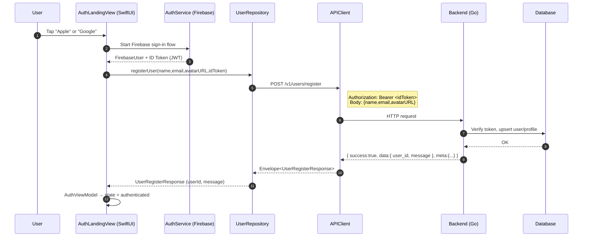

# Login + Register User Flow (AIPhotoApp)

Status: Draft v1
Last updated: 2025-10-19

Scope
- This document describes the end-to-end authentication flow of the iOS client and backend:
  UI (SwiftUI) → Firebase sign-in (Apple/Google) → Backend registration → Client state transition.
- It standardizes the request/response contracts, decoding strategy, and error handling to avoid client/server mismatches.

Architecture Overview
- iOS app (Swift/SwiftUI, Xcode) uses FirebaseAuth for identity via:
  - Sign in with Apple
  - Sign in with Google
- After successful provider login, the client obtains a Firebase ID Token (JWT), then calls the backend endpoint:
  - POST /v1/users/register
  - Headers: Authorization: Bearer <Firebase ID Token>
  - Body: JSON payload with user profile (name, email, avatarURL)
- Backend (Go) verifies the token, upserts user records, and returns a standardized JSON envelope:
  {
    "success": boolean,
    "data": {},
    "error": { "message": string, "code": string } | null,
    "meta": { "requestId": string, "timestamp": string }
  }

UX Change (2025-10-19)
- Users are no longer prompted to enter personal information (name/email) during login.
- ProfileCompletionView is no longer presented in AuthLandingView.
- AuthViewModel always attempts automatic registration using Firebase-provided displayName/email/photoURL without prompting the user.
- If the provider name is null/empty, the client derives name from the email local-part (substring before '@').
- On registration errors (including missing provider data or backend rejection), an error banner is shown on AuthLandingView; the user is not asked to fill a form.

Prerequisites & Configuration
- iOS
  - Firebase configured (GoogleService-Info.plist present in app target)
  - Dependencies: FirebaseAuth, GoogleSignIn
  - AppConfig.backendBaseURL = http://localhost:8080 (adjust per environment)
  - JSONDecoder keyDecodingStrategy = .convertFromSnakeCase across networking
- Backend
  - Endpoint: POST /v1/users/register
  - Firebase token verification middleware
  - DB migrations present under backend/migrations (users, profiles, unify)
  - Returns standardized envelope always

End-to-End Sequence
1) UI (SwiftUI)
   - View: AuthLandingView shows two buttons: “Sign in with Apple” and “Tiếp tục với Google”.
   - On tap, it delegates to AuthService to initiate provider sign-in.

2) Firebase Auth (Provider → Firebase)
   - AuthService orchestrates sign-in using FirebaseAuth.
   - On success, returns:
     - FirebaseUser (displayName, email, photoURL if provided)
     - Firebase ID Token (JWT) via user.getIDToken()

3) Client → Backend Registration
   - Repository: UserRepository.registerUser(name:email:avatarURL:bearerIDToken:)
   - Constructs DTO payload:
     - UserRegisterRequest { name: String, email: String, avatarURL: String? }
     - Note: camelCase property names to align with convertFromSnakeCase on the decoder.
   - API call:
     - Method: POST
     - URL: {AppConfig.backendBaseURL}/v1/users/register
     - Headers: Authorization: Bearer <Firebase ID Token>
     - Body: JSON of UserRegisterRequest
   - APIClient.sendEnvelope decodes Envelope<T> and extracts data when success=true.
     - If HTTP error, surfaces APIClientError.httpStatus(statusCode, body: String?).

4) Backend Processing (/v1/users/register)
   - Auth middleware verifies Firebase ID Token
   - Upsert user (and profile if needed) to the DB schema (see migrations)
   - Returns response envelope with data payload (e.g., user_id and message)

5) Client State Transition
   - Repository returns UserRegisterResponse { userId, message }
   - ViewModel (AuthViewModel) updates state → authenticated
   - UI transitions away from login to the main app
   - Network logging shows request/response with redaction of sensitive headers

Mermaid Sequence Diagram


API Contract: /v1/users/register
- Method: POST
- URL: {backendBaseURL}/v1/users/register
- Headers:
  - Authorization: Bearer <Firebase ID Token>
  - Content-Type: application/json
- Request body (JSON):
  {
    "name": "Jane Doe",
    "email": "jane@example.com",
    "avatarURL": "https://example.com/avatar.png"
  }
- Response (200 OK):
  {
    "success": true,
    "data": {
      "user_id": "usr_123",
      "message": "registered"
    },
    "meta": {
      "requestId": "req_abc",
      "timestamp": "2025-10-19T13:20:00Z"
    }
  }
- Error example (e.g., 401 or success=false):
  {
    "success": false,
    "error": {
      "message": "unauthorized",
      "code": "UNAUTHORIZED"
    },
    "meta": { "requestId": "req_def", "timestamp": "..." }
  }

Client Implementation References
- iOS
  - Utilities/Networking/APIClient.swift
    - sendEnvelope<T>(...) to decode Envelope<T>
    - JSONDecoder.keyDecodingStrategy = .convertFromSnakeCase
    - APIClientError.httpStatus(statusCode, body: String?)
    - Verbose request/response logging with redaction
  - Models/DTOs/AuthDTOs.swift
    - UserRegisterRequest { name, email, avatarURL? } – camelCase
    - UserRegisterResponse { userId, message } – camelCase
  - Repositories/UserRepository.swift
    - registerUser(name:email:avatarURL:bearerIDToken:)
    - Calls APIClient.sendEnvelope with Bearer token
  - Utilities/Constants/AppConfig.swift
    - backendBaseURL = "http://localhost:8080"
    - APIPath.registerUser = "/v1/users/register"
  - ViewModels/AuthViewModel.swift
    - On success → set authenticated state and navigate to main app
  - Services/AuthService.swift
    - Orchestrates Firebase sign-in, retrieves ID Token

- Backend (Go)
  - POST /v1/users/register
  - Firebase token verification
  - Upsert user/profile
  - Migrations:
    - backend/migrations/0001_create_users_table.up.sql
    - backend/migrations/0002_create_user_profiles_table.up.sql
    - backend/migrations/0003_unify_users_table.up.sql

Decoding Strategy & DTO Alignment
- All client decoding uses convertFromSnakeCase.
- DTOs must be camelCase to avoid mismatches.
- Example:
  ```swift
  struct UserRegisterRequest: Codable {
      let name: String
      let email: String
      let avatarURL: String?
  }

  struct UserRegisterResponse: Codable {
      let userId: String
      let message: String
  }
  ```
- Standard Envelope:
  ```json
  {
    "success": true,
    "data": { "...": "..." },
    "meta": { "requestId": "...", "timestamp": "..." }
  }
  ```

Error Handling
- HTTP errors:
  - Mapped to APIClientError.httpStatus(statusCode, body: String?)
  - Response body included for diagnostics
- Logical errors:
  - success=false with error object in envelope
- Token issues:
  - 401 Unauthorized (invalid/expired token)
  - Client should refresh Firebase ID Token and retry when appropriate

Testing Guidelines (TDD-aligned)
- iOS
  - Unit test: decode Envelope<UserRegisterResponse> from a sample JSON (prevents regression of “Invalid server response”)
  - Verify repository maps APIClient errors to domain-level NetworkError cleanly
- Backend
  - Integration test for /v1/users/register with valid Firebase token mock/stub
  - Verify DB upsert behavior and envelope response

Troubleshooting
- Symptom: “Invalid server response” shown in UI but logs show 200 OK with JSON
  - Check DTO casing: ensure camelCase fields (e.g., userId, avatarURL)
  - Ensure sendEnvelope<T> is used rather than decoding directly to T
  - Confirm Authorization header contains a valid Firebase ID Token
  - Validate AppConfig.backendBaseURL points to the running backend
  - Inspect APIClient logs for HTTP status and response body

Related Documents
- Refresh Token + Logout: .documents/auth/flow-refresh-logout.md

Change Log
- 2025-10-19: Initial draft created, documenting end-to-end flow, contracts, and troubleshooting.
