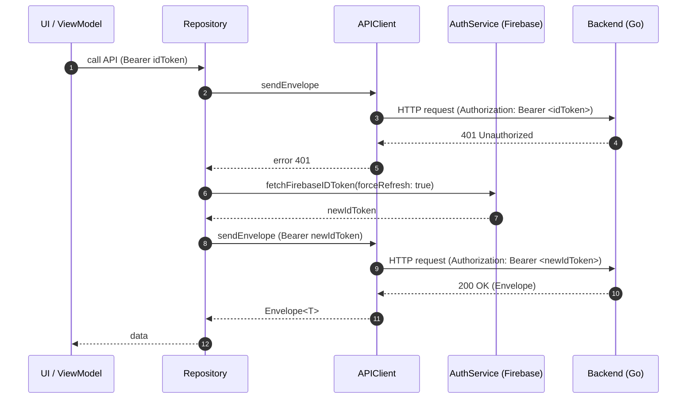
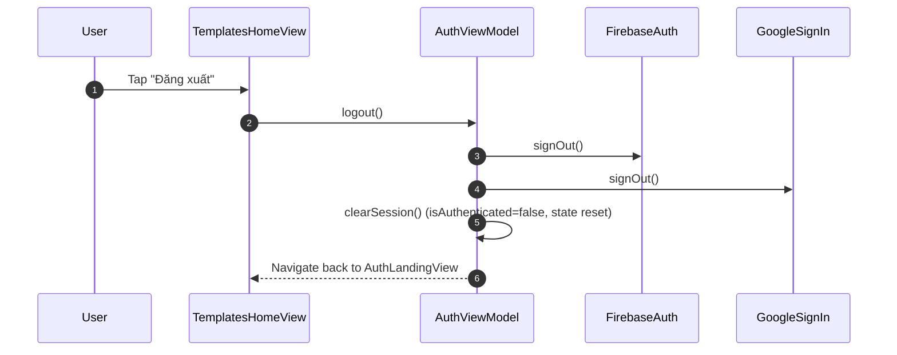

# Refresh Token + Logout Flows (AIPhotoApp)

Status: Draft v1
Last updated: 2025-10-25

Scope
- Defines client-side token refresh and logout flows for the iOS app using FirebaseAuth.
- Complements "Login + Register User Flow" by ensuring robust session maintenance and clean sign-out.

Overview
- The backend is stateless w.r.t. sessions; every request is authenticated with a Firebase ID Token (JWT).
- Firebase ID Tokens expire (~1 hour). The client must refresh tokens on demand when the backend returns 401.
- Logout clears Firebase session on-device and resets UI state; server does not require an explicit logout endpoint.

1) Refresh Token Flow (On-demand 401 retry)
- When an API call returns 401 Unauthorized, the client should:
  1) Fetch a new Firebase ID Token via AuthService.fetchFirebaseIDToken(forceRefresh: true)
  2) Retry the request once with the refreshed token
  3) If the retry also fails, surface error to UI (avoid infinite loops)

Implementation
- APIClient adds a convenience method:
  func sendEnvelopeRetry401<T>(
    _ request: APIRequest,
    as type: T.Type = T.self,
    authToken: String? = nil,
    decoder: JSONDecoder? = nil,
    tokenProvider: (() async throws -> String)? = nil
  ) async throws -> T

- Repository usage example (UserRepository.registerUser):
  ```swift
  let res: UserRegisterResponse =
    if let api, let tokenProvider {
      try await api.sendEnvelopeRetry401(req,
                                         as: UserRegisterResponse.self,
                                         authToken: bearerIDToken,
                                         decoder: nil,
                                         tokenProvider: tokenProvider)
    } else if let api {
      try await api.sendEnvelope(req,
                                 as: UserRegisterResponse.self,
                                 authToken: bearerIDToken,
                                 decoder: nil)
    } else {
      throw NetworkError.invalidResponse
    }
  ```

- ViewModel passes tokenProvider that refreshes the token:
  ```swift
  try await register(
    name: self.name,
    email: self.email,
    avatarURL: self.avatarURL,
    idToken: session.idToken,
    tokenProvider: { try await self.authService.fetchFirebaseIDToken(forceRefresh: true) }
  )
  ```

Mermaid Sequence Diagram (401 → refresh → retry)


Error Handling
- If refresh fails (e.g., user signed out, network issue), surface error to UI (banner).
- Ensure only a single retry per request to prevent loops.

2) Logout Flow
- Objectives:
  - Sign out from Firebase on-device (and GoogleSignIn if applicable)
  - Clear all in-memory state
  - Navigate to AuthLandingView

Implementation
- AuthViewModel.logout():
  ```swift
  @MainActor
  func logout() {
      isLoading = true
      errorMessage = nil
      Task {
          _ = try? Auth.auth().signOut()
          GIDSignIn.sharedInstance.signOut()
          await clearSession()
      }
  }

  @MainActor
  private func clearSession() {
      self.session = nil
      self.appleRawNonce = nil
      self.name = ""
      self.email = ""
      self.avatarURL = nil
      self.isAuthenticated = false
      self.isLoading = false
      self.errorMessage = nil
      self.requiresProfileCompletion = false
  }
  ```

- UI (TemplatesHomeView) provides a logout button:
  ```swift
  Button("Đăng xuất") { model.logout() }
  ```

Mermaid Sequence Diagram (Logout)


Notes and Constraints
- Server stateless logout: no backend endpoint needed; tokens expire naturally.
- If server adds revocation logic later, client can call a revoke endpoint prior to local sign-out (optional).
- All decoding uses convertFromSnakeCase; DTOs remain camelCase.

Testing Guidelines
- Unit test: APIClient 401 → tokenProvider invoked → retry success.
- Unit test: logout clears state (isAuthenticated=false, name/email empty).
- UI smoke test: tapping “Đăng xuất” returns to AuthLandingView.

Related Documents
- Login + Register: auth/login-register.md
