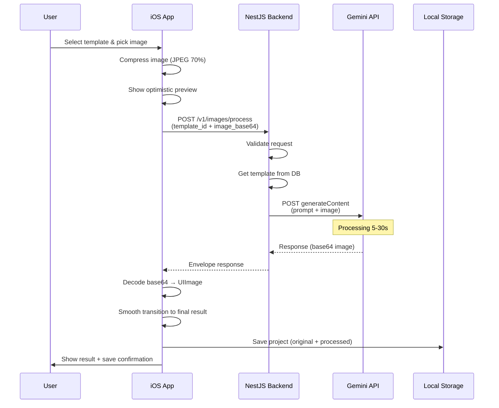

# Feature Specification: Gemini Image Processing

**Last updated:** 2025-10-27  
**Status:** Planning  
**Owner:** Backend Team + iOS Team

---

## Overview

Cho phép người dùng đã xác thực upload ảnh gốc, chọn template AI style, và nhận về ảnh đã được xử lý bởi Gemini AI. Backend đóng vai trò là stateless proxy, không lưu trữ ảnh. iOS App lưu trữ ảnh và lịch sử locally.

---

## Goals

### Primary Goals
- ✅ User có thể xử lý ảnh với AI style templates
- ✅ Response time chấp nhận được (< 60 seconds)
- ✅ Backend đơn giản, stateless, dễ scale
- ✅ Privacy-first: không lưu ảnh user trên server
- ✅ "My Projects" history lưu trên device

### Non-Goals (Phase 1)
- ❌ Backend storage cho ảnh processed
- ❌ Cloud sync history across devices
- ❌ Real-time progress streaming (SSE/WebSocket)
- ❌ Batch processing nhiều ảnh
- ❌ Video processing

---

## User Journey

### Happy Path

1. **Select Template**
   - User browse templates trong "All Templates" screen
   - Tap vào template → xem preview + description
   - Tap "Use Template" button

2. **Pick Image**
   - iOS photo picker hiện lên
   - User chọn ảnh từ Photos library
   - App auto-compress ảnh nếu > 5MB

3. **Processing**
   - Show instant "optimistic preview" (Core Image filter)
   - Display progress bar với estimated time (~15s)
   - Show status messages: "Uploading..." → "AI Processing..." → "Almost done..."

4. **Result**
   - Smooth transition từ preview → final result
   - Show before/after comparison slider
   - Options: Save, Share, Re-generate, Edit

5. **Save to History**
   - Auto-save vào "My Projects"
   - Thumbnail hiện trong grid view
   - Metadata: template name, date, dimensions

### Error Flows

#### 1. Network Error
- **Trigger:** No internet connection
- **Behavior:** 
  - Show alert: "No internet connection"
  - Don't consume API quota
  - Allow retry

#### 2. Image Too Large
- **Trigger:** Image > 10MB after compression
- **Behavior:**
  - Show alert: "Image is too large. Please choose a smaller photo."
  - Suggest resize options

#### 3. API Timeout
- **Trigger:** Gemini API không respond sau 60s
- **Behavior:**
  - Show alert: "Processing is taking longer than expected. Please try again."
  - Log error for monitoring
  - Allow retry with same image

#### 4. Rate Limit Exceeded
- **Trigger:** User vượt quota (free: 50/month)
- **Behavior:**
  - Show alert: "You've reached your monthly limit. Upgrade to Premium for unlimited processing."
  - Show upgrade button

#### 5. Invalid Content
- **Trigger:** Gemini API reject ảnh (inappropriate content)
- **Behavior:**
  - Show alert: "This image cannot be processed due to content policy."
  - Don't save to history

---

## Technical Architecture

### System Flow



### Data Flow

```
Original Image (2-5MB JPEG)
    ↓ iOS Compression (70%)
    ↓ (~500KB-1MB)
    ↓ Base64 Encode
    ↓ (~700KB-1.4MB base64 string)
    ↓ HTTP POST to Backend
    ↓ Backend validates & forwards
    ↓ Gemini API processes (5-30s)
    ↓ Response: base64 processed image (~1-2MB)
    ↓ Backend forwards to iOS
    ↓ iOS decodes base64 → UIImage
    ↓ Save to FileManager (2 files: original + processed)
    ↓ Save metadata to Core Data/UserDefaults
```

---

## API Specification

### POST /v1/images/process

**Purpose:** Process image với AI template (stateless proxy)

#### Request

```http
POST /v1/images/process HTTP/1.1
Host: api.example.com
Authorization: Bearer <firebase-id-token>
Content-Type: application/json

{
  "template_id": "uuid-template-123",
  "image_base64": "data:image/jpeg;base64,/9j/4AAQSkZJRg...",
  "options": {
    "width": 1024,
    "height": 1024,
    "quality": "standard"
  }
}
```

**Request Schema:**
```typescript
interface ProcessImageRequest {
  template_id: string;        // UUID from templates table
  image_base64: string;       // Base64 encoded image with data URI prefix
  options?: {
    width?: number;           // Default: 1024, Range: 512-2048
    height?: number;          // Default: 1024, Range: 512-2048
    quality?: 'standard' | 'high';  // Default: 'standard'
  };
}
```

**Validation Rules:**
- `template_id`: Must exist in database, status = published
- `image_base64`: Must be valid base64, mime type = image/jpeg or image/png
- Decoded image size: Max 10MB
- `width`, `height`: Must be multiples of 64 (Gemini requirement)

#### Response (Success - 200 OK)

```json
{
  "success": true,
  "data": {
    "processed_image_base64": "data:image/jpeg;base64,/9j/4AAQSkZJRg...",
    "metadata": {
      "template_id": "uuid-template-123",
      "template_name": "Anime Style",
      "model_used": "imagen-3-fast",
      "generation_time_ms": 8500,
      "original_dimensions": {
        "width": 1920,
        "height": 1080
      },
      "processed_dimensions": {
        "width": 1024,
        "height": 1024
      }
    }
  },
  "meta": {
    "requestId": "req_abc123xyz",
    "timestamp": "2025-10-27T10:30:45.123Z"
  }
}
```

#### Response (Error - 4xx/5xx)

```json
{
  "success": false,
  "error": {
    "code": "invalid_template",
    "message": "Template with ID 'xyz' not found or not published",
    "details": {
      "template_id": "xyz",
      "available_templates_count": 15
    }
  },
  "meta": {
    "requestId": "req_abc123xyz",
    "timestamp": "2025-10-27T10:30:45.123Z"
  }
}
```

**Error Codes:**

| Code | HTTP Status | Description | User Message |
|------|-------------|-------------|--------------|
| `unauthorized` | 401 | Firebase token invalid/expired | "Please sign in again" |
| `invalid_template` | 404 | Template not found | "This template is no longer available" |
| `invalid_image_format` | 400 | Image format not supported | "Please use JPEG or PNG format" |
| `image_too_large` | 413 | Image > 10MB | "Image is too large. Maximum 10MB." |
| `invalid_dimensions` | 400 | Width/height not valid | "Invalid image dimensions" |
| `rate_limit_exceeded` | 429 | User exceeded quota | "Monthly limit reached. Upgrade to continue." |
| `gemini_api_error` | 502 | Gemini API failed | "AI service unavailable. Try again." |
| `processing_timeout` | 504 | Processing > 60s | "Processing took too long. Please try again." |
| `inappropriate_content` | 422 | Content policy violation | "This image cannot be processed" |
| `internal_error` | 500 | Backend error | "Something went wrong. Please try again." |

---

## iOS Implementation Details

### Local Storage Structure

```
~/Library/Application Support/Projects/
  /project-{uuid}/
    /metadata.json          (ProjectMetadata struct)
    /original.jpg           (compressed 80%, max 2MB)
    /processed.jpg          (original quality from Gemini)
    /thumbnail.jpg          (200x200, quality 70%)
```

### ProjectMetadata Schema

```swift
struct ProjectMetadata: Codable {
    let id: UUID
    let templateId: String
    let templateName: String
    let createdAt: Date
    let generationTimeMs: Int
    
    struct FilePaths: Codable {
        let original: String
        let processed: String
        let thumbnail: String
    }
    let filePaths: FilePaths
    
    struct Dimensions: Codable {
        let width: Int
        let height: Int
    }
    let originalDimensions: Dimensions
    let processedDimensions: Dimensions
    
    var tags: [String]
    var isFavorite: Bool
    
    // For future features
    let modelUsed: String
    let processingCostCredits: Int?
}
```

### Core Image Filters for Optimistic Preview

**Filter Presets by Template Category:**

| Template Category | Core Image Filters | Parameters |
|-------------------|-------------------|------------|
| Anime | `CIColorControls` | saturation: 1.3 |
|       | `CISharpenLuminance` | sharpness: 0.5 |
| Portrait | `CIGaussianBlur` | radius: 2.0 (background) |
|          | `CIVignette` | intensity: 0.3 |
| Vintage | `CISepiaTone` | intensity: 0.5 |
|         | `CIVignette` | intensity: 0.5 |
| Realistic | `CISharpenLuminance` | sharpness: 0.4 |
|           | `CINoiseReduction` | level: 0.02 |

---

## Performance Requirements

### Response Time Targets

| Metric | Target | Maximum |
|--------|--------|---------|
| Image compression (iOS) | < 500ms | 1s |
| API request time | 5-15s | 60s |
| Base64 decode (iOS) | < 200ms | 500ms |
| Save to disk (iOS) | < 300ms | 1s |
| **Total user wait time** | **6-17s** | **62s** |

### Optimization Strategies

1. **Compression (iOS)**
   - Use JPEG with 70% quality
   - Resize to max 1920px on longest side
   - Target: 500KB-1MB encoded size

2. **Backend**
   - Keep HTTP connection alive (60s timeout)
   - No intermediate storage or processing
   - Forward Gemini response immediately

3. **Gemini API**
   - Use `imagen-3-fast` model (faster than `imagen-3`)
   - Request optimal dimensions (1024x1024)
   - Set reasonable timeout (45s on Gemini side)

---

## Security & Privacy

### Data Handling Policy

**Backend:**
- ✅ Validate Firebase token for every request
- ✅ Log analytics metadata only (no image data)
- ✅ Forward image to Gemini, receive result, send to client
- ❌ Never save image_base64 to disk/database
- ❌ Never log image content (only metadata like size, format)

**iOS:**
- ✅ All projects saved to app-sandboxed directory
- ✅ Encrypted by iOS FileProtection
- ✅ Deleted when app is uninstalled
- ❌ Never upload projects to backend automatically
- ⚠️ Optional: iCloud sync (Phase 2, user opt-in)

### Analytics Logging

**What we log (backend):**
```typescript
interface GenerationLog {
  id: uuid;
  user_id: string;             // Firebase UID
  template_id: uuid;
  created_at: timestamp;
  success: boolean;
  generation_time_ms: int;
  error_code?: string;
  
  // Image metadata (not content)
  original_size_bytes: int;
  original_dimensions: { width: int, height: int };
  processed_dimensions: { width: int, height: int };
  
  // Client info
  platform: 'ios' | 'android' | 'web';
  app_version: string;
  os_version: string;
}
```

**What we DON'T log:**
- ❌ Image binary data
- ❌ Base64 encoded strings
- ❌ User's photo content
- ❌ Personal identifiable info from images

---

## Rate Limiting & Quotas

### Free Tier
- **50 images/month**
- **Max 5MB per image**
- **Standard quality only**

### Premium Tier (Future)
- **Unlimited images**
- **Max 10MB per image**
- **High quality available**
- **Priority queue**

### Rate Limits
- **10 requests/minute** (prevent abuse)
- **100 requests/hour**
- **500 requests/day**

Implementation:
- Backend uses `@nestjs/throttler`
- Redis for distributed rate limiting
- Return 429 with `Retry-After` header

---

## Error Handling Strategy

### Backend Error Handling

```typescript
try {
  // 1. Validate request
  await this.validateRequest(req);
  
  // 2. Get template
  const template = await this.templatesService.findOne(req.template_id);
  
  // 3. Call Gemini with timeout
  const result = await Promise.race([
    this.geminiService.generateImage(req),
    this.timeout(60000) // 60s timeout
  ]);
  
  // 4. Return result
  return this.envelopeResponse(result);
  
} catch (error) {
  if (error instanceof TimeoutError) {
    throw new GatewayTimeoutException('Processing took too long');
  }
  if (error instanceof GeminiAPIError) {
    throw new BadGatewayException('AI service error');
  }
  // ... handle other errors
  throw error;
}
```

### iOS Error Handling

```swift
do {
  let response = try await apiClient.processImage(request)
  // Success: save and show result
  
} catch APIError.unauthorized {
  // Re-authenticate
  await authViewModel.refreshToken()
  
} catch APIError.rateLimitExceeded {
  // Show upgrade prompt
  showUpgradeAlert()
  
} catch APIError.timeout {
  // Allow retry
  showRetryAlert()
  
} catch {
  // Generic error
  showErrorAlert(error.localizedDescription)
}
```

---

## Testing Strategy

### Backend Tests

**Unit Tests (`images.service.spec.ts`):**
- [ ] Validate image format
- [ ] Validate image size
- [ ] Validate template exists
- [ ] Handle Gemini API success response
- [ ] Handle Gemini API error response
- [ ] Handle timeout scenarios
- [ ] Log analytics correctly

**E2E Tests (`images.e2e-spec.ts`):**
- [ ] POST /v1/images/process with valid request → 200
- [ ] POST with invalid token → 401
- [ ] POST with invalid template_id → 404
- [ ] POST with oversized image → 413
- [ ] POST with invalid format → 400
- [ ] POST when rate limited → 429

### iOS Tests

**Unit Tests (`ImageProcessingViewModelTests.swift`):**
- [ ] Compress image correctly
- [ ] Generate optimistic preview
- [ ] Handle API success response
- [ ] Handle API error responses
- [ ] Save project to local storage
- [ ] Load projects from storage
- [ ] Delete project correctly

**UI Tests (`ImageProcessingUITests.swift`):**
- [ ] Select template → pick image → see processing → see result flow
- [ ] Cancel during processing
- [ ] Retry after error
- [ ] Save to My Projects
- [ ] Share result

---

## Monitoring & Observability

### Key Metrics to Track

**Backend:**
- Request count by status (200, 4xx, 5xx)
- Average generation time (p50, p95, p99)
- Gemini API success rate
- Rate limit hits
- Error rate by error_code

**iOS:**
- Crash rate during processing
- Average compression time
- Average save-to-disk time
- User retry rate
- Project deletion rate

### Alerts

- 🚨 Gemini API error rate > 5% (15min window)
- 🚨 Average generation time > 45s (5min window)
- 🚨 Backend error rate > 2% (15min window)
- ⚠️ Rate limit hits > 100/hour (potential abuse)

---

## Future Enhancements (Phase 2+)

### Short-term (1-3 months)
- [ ] Server-Sent Events for real-time progress
- [ ] Batch processing (multiple images)
- [ ] Custom prompt override (advanced users)
- [ ] Image history sync via backend (optional opt-in)

### Mid-term (3-6 months)
- [ ] Video style transfer
- [ ] Face-specific enhancements
- [ ] Template marketplace (community templates)
- [ ] Social sharing with attribution

### Long-term (6-12 months)
- [ ] On-device ML for instant preview (CoreML)
- [ ] Multi-provider support (Stable Diffusion, Midjourney)
- [ ] Collaborative editing
- [ ] Template creation tools

---

## References

- [Gemini API Documentation](https://ai.google.dev/gemini-api/docs)
- [Imagen 3 Model Specs](https://ai.google.dev/gemini-api/docs/imagen)
- [NestJS Timeout Handling](https://docs.nestjs.com/techniques/configuration)
- [iOS Image Compression Best Practices](https://developer.apple.com/documentation/uikit/uiimage)
- [Firebase Auth iOS SDK](https://firebase.google.com/docs/auth/ios/start)

---

## Glossary

- **Optimistic Preview:** Instant preview generated locally using Core Image filters, replaced by actual AI result when ready
- **Stateless Proxy:** Backend that forwards requests without maintaining session state or storing data
- **Envelope Response:** Standardized response format with `success`, `data`, `error`, and `meta` fields
- **Base64 Data URI:** Format `data:image/jpeg;base64,<base64-string>` for embedding images in JSON
- **Rate Limiting:** Restricting number of API calls per time period to prevent abuse

