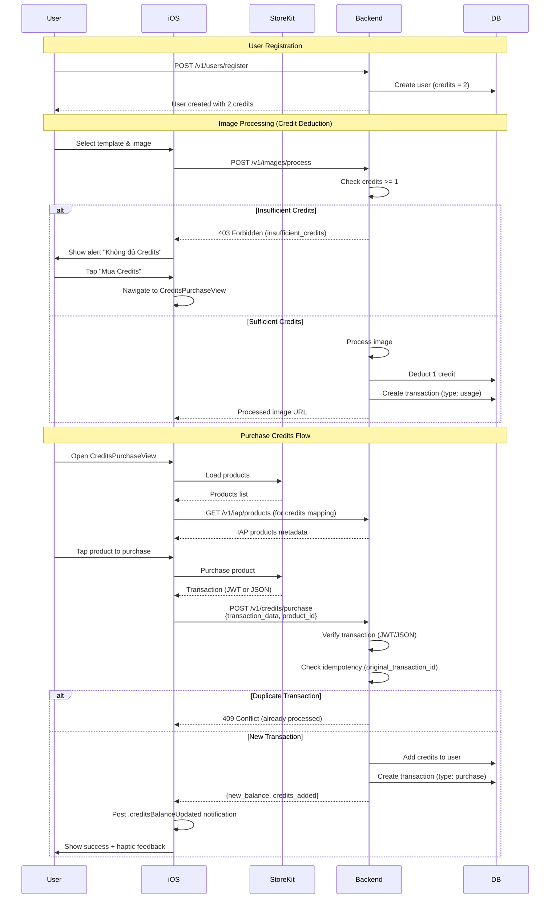

# In-App Purchase Credits System

**Status**: ✅ Implemented  
**Last Updated**: 2025-11-09  
**Owner**: @anhtu

## Purpose & Scope

This feature implements a credits-based monetization system for the AIPhotoApp using Apple In-App Purchase (IAP) with StoreKit 2. Users receive 2 free credits upon registration, and each image generation consumes 1 credit. When credits are depleted, users are prompted to purchase additional credits through consumable IAP products.

### Scope
- ✅ Credits balance management (database, API, iOS display)
- ✅ IAP product management (3 default packages: 10, 50, 100 credits)
- ✅ Purchase flow with StoreKit 2 (iOS 15-17 JWT, iOS 26+ JSON)
- ✅ Transaction verification and idempotency
- ✅ Credit deduction enforcement for image processing
- ✅ Transaction history tracking
- ✅ Web CMS for viewing IAP products and transaction history
- ✅ UI/UX improvements (animations, haptic feedback, auto-refresh)

### Out of Scope
- Restore purchases (credits stored in database, no need for restore)
- Subscription products (future enhancement)
- Android IAP (iOS only for now)

## Sources of Truth

- **API Contract**: `swagger/openapi.yaml` (paths: `/v1/credits/*`, `/v1/iap/*`)
- **Database Schema**: `server/prisma/schema.prisma` (User.credits, Transaction, IAPProduct models)
- **Migration**: `server/prisma/migrations/20251109190005_add_credits_and_iap_system/`
- **Backend Code**:
  - `server/src/credits/` (CreditsModule, CreditsService, CreditsController)
  - `server/src/iap/` (IAPModule, IAPService, IAPController)
  - `server/src/images/images.service.ts` (credit enforcement)
- **iOS Code**:
  - `AIPhotoApp/AIPhotoApp/Services/InAppPurchaseService.swift`
  - `AIPhotoApp/AIPhotoApp/Repositories/CreditsRepository.swift`
  - `AIPhotoApp/AIPhotoApp/ViewModels/CreditsViewModel.swift`
  - `AIPhotoApp/AIPhotoApp/Views/Credits/CreditsPurchaseView.swift`
- **Web CMS Code**:
  - `web-cms/src/pages/IAP/IAPProductsPage.tsx`
  - `web-cms/src/pages/Transactions/TransactionsPage.tsx`
  - `web-cms/src/api/credits.ts`
- **Implementation Plan**: `.implementation_plan/in-app-purchase-credits-system-plan.md`
- **UI/UX Improvements**: `.implementation_plan/ux-improvements-iap-credits-plan.md`

## System Flow



## Database Schema

### User Model
```prisma
model User {
  id        String   @id @default(uuid())
  firebaseUid String @unique
  name      String
  email     String
  avatarUrl String?
  credits   Int      @default(2)  // New field
  createdAt DateTime @default(now())
  updatedAt DateTime @updatedAt
}
```

### Transaction Model
```prisma
enum TransactionType {
  purchase
  usage
  bonus
}

enum TransactionStatus {
  pending
  completed
  failed
  refunded
}

model Transaction {
  id                        String            @id @default(uuid())
  userId                    String
  type                      TransactionType
  amount                    Int               // Credits amount (+ for purchase/bonus, - for usage)
  productId                 String?           // IAP product ID (for purchase type)
  appleTransactionId        String?           // StoreKit transaction ID
  appleOriginalTransactionId String?          // For idempotency check
  transactionData          String?           // JWT or JSON string from StoreKit
  status                   TransactionStatus @default(completed)
  createdAt                DateTime          @default(now())
  updatedAt                DateTime          @updatedAt

  user                     User              @relation(fields: [userId], references: [id])

  @@index([userId])
  @@index([appleOriginalTransactionId])
}
```

### IAPProduct Model
```prisma
model IAPProduct {
  id          String   @id @default(uuid())
  productId   String   @unique  // StoreKit product ID
  name        String
  description String?
  credits     Int      // Credits awarded when purchased
  price       Decimal?
  currency    String?
  isActive    Boolean  @default(true)
  displayOrder Int     @default(0)
  createdAt   DateTime @default(now())
  updatedAt   DateTime @updatedAt
}
```

## API Endpoints

### Credits Endpoints

#### GET /v1/credits/balance
Get current user's credits balance.

**Auth**: Required (Bearer Firebase ID token)

**Response**:
```json
{
  "success": true,
  "data": {
    "balance": 2
  },
  "meta": {
    "requestId": "...",
    "timestamp": "2025-11-09T..."
  }
}
```

#### GET /v1/credits/transactions
Get user's transaction history with pagination.

**Auth**: Required

**Query Parameters**:
- `limit` (optional, default: 20, max: 100)
- `offset` (optional, default: 0)
- `type` (optional): `purchase`, `usage`, `bonus`
- `status` (optional): `pending`, `completed`, `failed`, `refunded`

**Response**:
```json
{
  "success": true,
  "data": {
    "transactions": [
      {
        "id": "uuid",
        "type": "purchase",
        "amount": 10,
        "product_id": "com.bokphoto.credits.starter",
        "status": "completed",
        "created_at": "2025-11-09T..."
      }
    ],
    "total": 5,
    "limit": 20,
    "offset": 0
  }
}
```

#### POST /v1/credits/purchase
Process IAP purchase and add credits to user.

**Auth**: Required

**Request Body**:
```json
{
  "transaction_data": "{\"transaction_id\":\"...\",\"original_transaction_id\":\"...\",\"product_id\":\"...\"}"  // JSON (iOS 26+) or JWT (iOS 15-17)
  "product_id": "com.bokphoto.credits.starter"
}
```

**Response**:
```json
{
  "success": true,
  "data": {
    "new_balance": 12,
    "credits_added": 10
  }
}
```

**Error Responses**:
- `400 Bad Request`: Invalid transaction data
- `409 Conflict`: Transaction already processed (idempotency)
- `404 Not Found`: IAP product not found

### IAP Endpoints

#### GET /v1/iap/products
Get list of available IAP products (public endpoint, no auth required).

**Response**:
```json
{
  "success": true,
  "data": {
    "products": [
      {
        "id": "uuid",
        "product_id": "com.bokphoto.credits.starter",
        "name": "Starter Pack",
        "description": "10 credits to get started",
        "credits": 10,
        "price": 0.99,
        "currency": "USD",
        "is_active": true,
        "display_order": 1
      }
    ]
  }
}
```

## Business Rules

### Credits Management
1. **New User Registration**: All new users receive 2 free credits upon registration.
2. **Existing Users Migration**: All existing users were updated to have 2 credits when migration ran.
3. **Credit Deduction**: Each successful image processing deducts 1 credit.
4. **Credit Check**: Image processing is blocked if user has < 1 credit (returns 403 Forbidden with `insufficient_credits` error code).

### IAP Purchase Flow
1. **Product Loading**: iOS loads products from both StoreKit (for pricing) and backend API (for credits mapping).
2. **Transaction Verification**: Backend verifies transaction data:
   - **iOS 26+**: Receives JSON string with transaction details
   - **iOS 15-17**: Receives JWT string from `Transaction.jwsRepresentation`
   - Backend parses both formats and extracts required fields
3. **Idempotency**: Uses `original_transaction_id` to prevent duplicate credit awards if purchase is processed multiple times.
4. **Atomicity**: Credit addition and transaction creation happen in a single Prisma transaction.

### Transaction Types
- **purchase**: Credits added from IAP purchase
- **usage**: Credits deducted for image processing
- **bonus**: Credits added from promotions (future use)

### Transaction Status
- **completed**: Transaction successfully processed
- **pending**: Transaction in progress (not used currently)
- **failed**: Transaction failed (not used currently)
- **refunded**: Transaction refunded by Apple (future handling)

## Default IAP Products

Three default consumable products are seeded in the database:

1. **Starter Pack** (`com.bokphoto.credits.starter`)
   - Credits: 10
   - Display Order: 1

2. **Popular Pack** (`com.bokphoto.credits.popular`)
   - Credits: 50
   - Display Order: 2

3. **Best Value Pack** (`com.bokphoto.credits.bestvalue`)
   - Credits: 100
   - Display Order: 3

**Note**: Actual pricing is managed in App Store Connect. Backend stores metadata (name, description, credits) for display purposes.

## iOS Implementation

### StoreKit 2 Integration
- Uses `Product` and `Transaction` from StoreKit 2
- Loads products using `Product.products(for:)`
- Handles purchase using `Product.purchase()`
- For iOS 26+: Serializes transaction details to JSON (no `jwsRepresentation` available)
- For iOS 15-17: Uses `Transaction.jwsRepresentation` (JWT format)

### CreditsViewModel
- `@Observable` class for state management
- Loads products from StoreKit + server in parallel
- Maps product IDs to credits using server metadata
- Posts `.creditsBalanceUpdated` notification after successful purchase
- Provides haptic feedback on successful purchase

### CreditsPurchaseView
- Displays current credits balance with animation
- Lists IAP products with credits count from server mapping
- Handles purchase flow with loading states
- Shows success/error alerts (user dismisses manually)
- Supports refresh button and pull-to-refresh

### ImageProcessingView Integration
- Displays credits balance in header (glass card style)
- Shows alert when insufficient credits
- Navigates to CreditsPurchaseView on "Mua Credits" button
- Listens for `.creditsBalanceUpdated` notification to auto-refresh balance

### ProfileView Integration
- Displays credits balance in stats section
- "Buy Credits" button in account section
- Listens for `.creditsBalanceUpdated` notification

## Web CMS Implementation

### IAP Products Page
- Lists all active IAP products in table format
- Displays: Product ID, Name, Description, Credits, Price, Display Order
- Read-only view (products managed in App Store Connect)

### Transaction History Page
- Lists user transactions with pagination
- Filters: Type (purchase/usage/bonus), Status (completed/pending/failed/refunded)
- Search: Transaction ID or Product ID
- Color-coded transaction types and statuses
- Pull-to-refresh and refresh button support

## Error Handling

### Insufficient Credits
- **Backend**: Returns `403 Forbidden` with error code `insufficient_credits`
- **iOS**: `BackgroundImageProcessor` parses error and notifies with `ProcessingError.insufficientCredits`
- **iOS UI**: Shows alert "Không đủ Credits" with "Mua Credits" button

### Purchase Errors
- **User Cancelled**: `InAppPurchaseError.userCancelled`
- **Verification Failed**: `InAppPurchaseError.verificationFailed`
- **Purchase Failed**: `InAppPurchaseError.purchaseFailed`
- **Pending**: `InAppPurchaseError.pending` (transaction pending approval)

### Duplicate Transaction
- Backend checks `original_transaction_id` in database
- Returns `409 Conflict` if transaction already processed
- Prevents duplicate credit awards

## UI/UX Features

### Visual Enhancements
- ✅ Glass card style credits header in ImageProcessingView
- ✅ Smooth number animations when credits balance changes (`.contentTransition(.numericText())`)
- ✅ Haptic feedback on successful purchase (`UINotificationFeedbackGenerator.success`)

### User Experience
- ✅ ProductCard loads credits from backend API (not regex extraction)
- ✅ Success message stays until user dismisses (no auto-clear)
- ✅ Refresh button and pull-to-refresh in CreditsPurchaseView
- ✅ Auto-refresh balance across screens using NotificationCenter

## Testing

### Backend Tests
- Unit tests for CreditsService (balance, deduct, add, history)
- Unit tests for IAPService (verify transaction, process purchase, idempotency)
- E2E tests for credits endpoints
- E2E tests for purchase flow with mock transaction data

### iOS Tests
- Unit tests for CreditsViewModel (load products, purchase flow)
- Unit tests for CreditsRepository (API calls)
- Mock StoreKit for testing purchase flow
- UI tests for CreditsPurchaseView

### Manual Testing Checklist
- [x] New user receives 2 credits
- [x] Image processing deducts 1 credit
- [x] Insufficient credits blocks processing
- [x] Purchase flow works end-to-end
- [x] Idempotency prevents duplicate credits
- [x] Transaction history displays correctly
- [x] Credits balance updates across screens
- [x] Animations and haptic feedback work

## Security Considerations

1. **Transaction Verification**: Backend verifies all transaction data before awarding credits
2. **Idempotency**: Prevents duplicate credit awards using `original_transaction_id`
3. **Atomicity**: Credit updates and transaction creation in single database transaction
4. **Auth Required**: All credits endpoints require Firebase ID token authentication
5. **Server-Side Validation**: Credits deduction enforced server-side, not client-side

## Future Enhancements

1. **Subscription Products**: Support for auto-renewable subscriptions
2. **Bonus Credits**: Promotional credits system
3. **Transaction Refunds**: Handle Apple refunds and deduct credits
4. **Analytics**: Track purchase conversion, revenue, popular products
5. **A/B Testing**: Test different product packages and pricing
6. **Restore Purchases**: Optional restore flow for user support

## Changelog

### 2025-11-09: Initial Implementation
- ✅ Database schema with credits, transactions, IAP products
- ✅ Backend API for credits management and IAP processing
- ✅ iOS StoreKit 2 integration
- ✅ Credits deduction enforcement
- ✅ Transaction history tracking
- ✅ Web CMS pages for IAP products and transactions
- ✅ UI/UX improvements (animations, haptic, auto-refresh)

## Acceptance Criteria

- [x] New users receive 2 free credits upon registration
- [x] Existing users have 2 credits (migration applied)
- [x] Image processing deducts 1 credit per successful generation
- [x] Insufficient credits error blocks processing and shows alert
- [x] Purchase flow works end-to-end (StoreKit → Backend → Credits added)
- [x] Idempotency prevents duplicate credit awards
- [x] Transaction history displays correctly with filters
- [x] Credits balance displayed in ImageProcessingView header and ProfileView
- [x] UI/UX improvements (animations, haptic, refresh) working
- [x] Web CMS displays IAP products and transaction history

