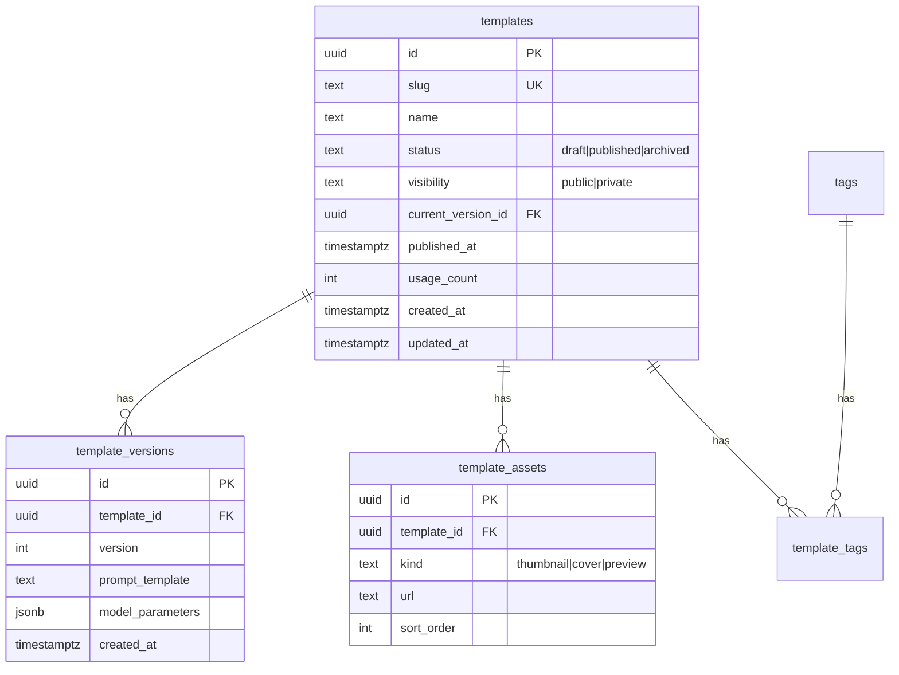

# Template Spec — API, Data Model, Business Rules

Trạng thái: Stable  
Phiên bản: 1.0  
Cập nhật: 2025-10-23

Tài liệu hợp nhất mọi thông tin liên quan đến “Template” để đảm bảo phát triển đồng bộ (documentation-driven). Nguồn tham chiếu chính:
- Swagger/OpenAPI: `swagger/openapi.yaml`
- Mô hình dữ liệu: `architecture/data-model/templates.md`
- Kiến trúc dự án: `architecture/system-architecture.md`
- Web Admin: `platform-guides/web-cms.md`
- Workflow & tiêu chuẩn phản hồi: `workflows/doc-driven.md`, `api/standards.md`


## 1) Mục tiêu & Phạm vi

- Chuẩn hóa API công khai (iOS) và Admin (Web CMS) cho Template.
- Làm rõ model dữ liệu (Postgres), quy tắc publish, quản lý assets (thumbnail/preview/cover).
- Đảm bảo tính nhất quán “envelope response”, xác thực Bearer (Firebase ID Token), và UX upload/thumbnail trong Web CMS.


## 2) Thuật ngữ & Định danh

- slug: chuỗi định danh “đẹp URL”, duy nhất trong phạm vi templates (ví dụ `anime-style`).
- id: định danh hiển thị cho client. Lưu ý:
  - Ở DB: `templates.id` là UUID.
  - Ở API (hiện tại theo ví dụ trong Swagger), `Template.id` có thể là slug-like. Cần thống nhất tiêu chuẩn hiển thị (khuyến nghị expose `slug` rõ ràng cho client, đồng thời có thể giữ `id` là UUID nếu cần).
- kind (asset): `thumbnail | preview | cover`
- visibility: `public | private`
- status: `draft | published | archived`


## 3) API Công khai (iOS)

### GET /v1/templates
- Mục đích: liệt kê templates cho end-user.
- Auth: Bearer (Firebase ID token).
- Query params:
  - `limit` (int, default 20, min 1)
  - `offset` (int, default 0, min 0)
  - `q` (string): tìm theo name/slug
  - `tags` (CSV string): ví dụ `anime,portrait`
  - `category` (string): lọc theo category (portrait, landscape, artistic, vintage, abstract). Category được map sang tags để filter.
  - `sort` (newest|popular|name, default newest)
- Envelope Response: `EnvelopeTemplatesList { success, data{ templates: Template[] }, error?, meta{ requestId, timestamp } }`
- Trường trong `Template`:
  - `id` (chuỗi ổn định cho client)
  - `name` (bắt buộc)
  - `thumbnailUrl` (optional)
  - `publishedAt` (optional)
  - `usageCount` (optional)
- Sorting:
  - `newest`: theo `publishedAt` DESC
  - `popular`: theo `usageCount` DESC
  - `name`: theo `name` ASC
- Filter:
  - `q`: match tên/slug (ILIKE)
  - `tags`: join theo bảng tags (nếu có), lọc các template có chứa tất cả tag đã gửi (hoặc OR — tùy yêu cầu, đề xuất rõ ràng trong implementation)
  - `category`: map category sang tags array (ví dụ: `portrait` → `["portrait", "chân dung", "person", "people"]`), sau đó filter bằng `tags.hasSome`. Category và tags parameter có thể kết hợp (union).
- Backend: join `template_assets(kind='thumbnail')` để lấy `thumbnail_url` và trả về full absolute URL (ví dụ `http://localhost:8080/assets/...` hoặc `https://cdn.example.com/assets/...`), không dùng đường dẫn tương đối.

### GET /v1/templates/categories
- Mục đích: lấy danh sách categories có sẵn cho filtering.
- Auth: Bearer (Firebase ID token).
- Response: `EnvelopeCategoriesList { success, data{ categories: Category[] }, error?, meta{ requestId, timestamp } }`
- Trường trong `Category`:
  - `id` (string): UUID of category
  - `name` (string): category display name (Vietnamese)
  - `slug` (string): category slug for URL-friendly identifier
  - `displayOrder` (number): sort order (ascending)
- **Database-Driven**: Categories are stored in `categories` table and fetched dynamically
  - `GET /v1/categories` - Public endpoint returns all categories from database
  - `GET /v1/templates/categories` - Calls `CategoriesService.findAll()` internally
  - Sorted by `displayOrder ASC` (manual ordering via Web CMS)
- **Template Association**: Templates can be associated with a category via `categoryId` foreign key
  - Filtering: `GET /v1/templates?category={categoryId}` uses direct relation instead of tag mapping

Ví dụ Response:
```json
{
  "success": true,
  "data": {
    "templates": [
      {
        "id": "anime-style",
        "name": "Phong cách Anime",
        "thumbnail_url": "http://localhost:8080/assets/templates/anime-style/thumb.png",
        "published_at": "2025-10-20T07:30:00Z",
        "usage_count": 120345
      }
    ]
  },
  "meta": {
    "requestId": "8f9a1b2c3d4e5f6a",
    "timestamp": "2025-10-23T04:00:00Z"
  }
}
```


## 4) API Xử lý ảnh (tham chiếu Template)

### POST /v1/images/process
- Mục đích: Xử lý ảnh theo template đã chọn (sau khi upload ảnh).
- Body: `ProcessImageRequest { template_id, image_path }`
- Response: `EnvelopeProcessImageSuccess { processed_image_url }`
- Lưu ý: prompt/params bí mật chỉ xử lý server-side; client không thấy.


## 5) API Admin — Templates

### List/Create
- GET `/v1/admin/templates`
  - Query: `limit, offset, q, tags, status(draft|published|archived), visibility(public|private), sort(updated|newest|popular|name), trending(all|manual|none)`
  - Response: `EnvelopeAdminTemplatesList { templates: TemplateAdmin[] }`
- POST `/v1/admin/templates`
  - Body: `TemplateAdminCreate`
  - Response: `201 EnvelopeTemplateAdmin`

### Detail/Update/Delete
- GET `/v1/admin/templates/{slug}`
  - Response: `EnvelopeTemplateAdmin`
- PUT `/v1/admin/templates/{slug}`
  - Body: `TemplateAdminUpdate`
  - Response: `EnvelopeTemplateAdmin`
- DELETE `/v1/admin/templates/{slug}`
  - Response: `EnvelopeSuccess`

### Publish/Unpublish
- POST `/v1/admin/templates/{slug}/publish`
- POST `/v1/admin/templates/{slug}/unpublish`
- Guard: Publish yêu cầu phải có `thumbnail_url` hợp lệ (thiếu ⇒ `422 validation_error`).

### Trending Management
- POST `/v1/admin/templates/{slug}/trending`
  - Đánh dấu template là trending thủ công
  - Response: `EnvelopeTemplateAdmin` với `isTrendingManual: true`
- DELETE `/v1/admin/templates/{slug}/trending`
  - Gỡ bỏ template khỏi danh sách trending thủ công
  - Response: `EnvelopeTemplateAdmin` với `isTrendingManual: false`
- Query parameter `trending` trong `/v1/admin/templates`:
  - `trending=manual`: Lọc các template được đánh dấu trending thủ công
  - `trending=none`: Lọc các template không trending
  - `trending=all` (default): Tất cả templates, không lọc theo trending

`TemplateAdmin` (rút gọn theo Swagger):
- Trường chính: `id`, `slug`, `name`, `description?`, `prompt?`, `negativePrompt?`, `modelProvider?`, `modelName?`, `thumbnail_url?`, `status`, `visibility`, `published_at?`, `usage_count?`, `updated_at?`, `tags?[]`, `isTrendingManual?`
- **Response Format**: API trả về camelCase fields (`thumbnailUrl`, `publishedAt`, `usageCount`, `isTrendingManual`, `createdAt`, `updatedAt`)


## 6) API Admin — Template Assets

### List/Upload
- GET `/v1/admin/templates/{slug}/assets`
  - Response: `EnvelopeTemplateAssets { data: TemplateAssetAdmin[] }`
- POST `/v1/admin/templates/{slug}/assets` (multipart/form-data)
  - Form: `kind ∈ {thumbnail, cover, preview}`, `file` (png|jpeg)
  - Kích thước tối đa ~12MB (DEV).
  - Response: `201 EnvelopeTemplateAsset`

### Update/Delete
- PUT `/v1/admin/templates/{slug}/assets/{id}`
  - Body JSON: `kind? (thumbnail|cover|preview)`, `sort_order? (int)`
  - Response: `EnvelopeTemplateAsset`
- DELETE `/v1/admin/templates/{slug}/assets/{id}`
  - Response: `EnvelopeSuccess`

Quy tắc:
- Thumbnail duy nhất cho mỗi template:
  - Khi promote một preview thành thumbnail, các thumbnail cũ phải demote về preview.
- Static Serving:
  - Ảnh được phục vụ bởi backend tại `/assets/templates/{slug}/{filename}`.
  - Docker volume mount: `../backend/assets:/assets`.
- CORS:
  - Cho phép `http://localhost:5173`; headers: `Authorization, Content-Type`.


## 7) Business Rules & Envelope

- Envelope là chuẩn response duy nhất:
  - `success: boolean`
  - `data: <payload>`
  - `error: { code, message, details? }` (khi fail)
  - `meta: { requestId, timestamp }` (+ metadata phân trang trong tương lai)
- Auth:
  - Bearer (Firebase ID Token) cho mọi call; client tự refresh-and-retry once khi `401`.
- Publish Guard:
  - Không publish nếu template chưa có `thumbnailUrl` ⇒ `422`.
- Sorting/Filtering:
  - Như phần API công khai & admin.
- Storage:
  - Dev: local volume `/assets`; Prod: cân nhắc S3/CDN. Duy trì `ASSETS_BASE_URL` là absolute URL để trừu tượng hoá và đảm bảo API trả full URL.


## 8) Data Model (PostgreSQL)

Tham chiếu chi tiết: `architecture/data-model/templates.md`.

Tóm tắt:
- Bảng `templates`:
  - `id UUID PK`, `slug TEXT UNIQUE`, `name TEXT`, `description?`, `status`, `visibility`,
  - `current_version_id UUID FK → template_versions`, `published_at`, `usage_count?`, `created_at`, `updated_at`
- Bảng `template_versions`:
  - Versioning prompt/params (immutable), JSONB fields `prompt_variables`, `model_parameters`, v.v.
- Bảng taxonomy và assets:
  - `tags`, `template_tags`
  - `categories`, `template_categories`
  - `template_assets`: `id UUID PK`, `template_id UUID FK`, `kind`, `url`, `sort_order`
- Migrations liên quan:
  - `0004_create_templates_and_versions.up.sql`
  - `0005_create_template_taxonomy_and_assets.up.sql`
  - `0006_add_usage_count.up.sql`

Mermaid ERD (rút gọn):



## 9) Map tới Source Code

- Backend (Go):
  - API handlers/middleware: `backend/internal/api/`
    - `admin_templates.go`, `admin_assets.go`, `handlers.go`, `middleware.go`, `routes.go`
  - Database/Data access: `backend/internal/database/`
    - `admin_templates.go`, `admin_assets.go`, `postgres.go`, `database.go`
  - Storage helpers: `backend/internal/storage/storage.go`
    - `AssetsDir()`, `AssetsBaseURL()`, `SaveTemplateAssetFile()`
  - Models: `backend/internal/models/models.go`
  - Entrypoint static: `backend/cmd/api/main.go` (serve `/processed/*` và `/assets/*`)
  - Migrations: `backend/migrations/0004..0006`
- Web CMS (React+Vite+TS) — repo dùng thư mục `web-cms/`:
  - API client: `web-cms/src/api/client.ts` (Axios + envelope unwrap + Bearer + 401 retry)
  - Public templates: `web-cms/src/api/templates.ts`
  - Admin API: `web-cms/src/api/admin/*` (CRUD + assets)
  - Types: `web-cms/src/types/{template.ts, admin.ts, envelope.ts}`
  - UI: `web-cms/src/pages/{Admin/*, Templates/*}`
  - Auth: `web-cms/src/auth/*` (Firebase/DevAuth + ProtectedRoute)
- iOS (SwiftUI):
  - DTOs: `AIPhotoApp/AIPhotoApp/Models/DTOs/TemplatesDTOs.swift`
  - Repository: `AIPhotoApp/AIPhotoApp/Repositories/TemplatesRepository.swift`
  - Networking: `AIPhotoApp/AIPhotoApp/Utilities/Networking/APIClient.swift`
  - UI: `AIPhotoApp/AIPhotoApp/Views/Home/TemplatesHomeView.swift`


## 10) Ví dụ Request/Response

- GET `/v1/templates?limit=20&offset=0&sort=newest`
```http
GET /v1/templates?limit=20&offset=0&sort=newest HTTP/1.1
Authorization: Bearer <ID_TOKEN>
Accept: application/json
```
Response: xem mẫu ở mục 3.

- POST `/v1/admin/templates/{slug}/assets` (multipart)
```http
POST /v1/admin/templates/watercolor-a/assets HTTP/1.1
Authorization: Bearer <ID_TOKEN>
Content-Type: multipart/form-data; boundary=----XYZ

------XYZ
Content-Disposition: form-data; name="kind"

thumbnail
------XYZ
Content-Disposition: form-data; name="file"; filename="thumb.png"
Content-Type: image/png

<binary>
------XYZ--
```

- PUT `/v1/admin/templates/{slug}/assets/{id}`
```json
{
  "kind": "thumbnail",
  "sort_order": 0
}
```

- POST `/v1/admin/templates/{slug}/publish`
```http
POST /v1/admin/templates/watercolor-a/publish HTTP/1.1
Authorization: Bearer <ID_TOKEN>
```
- Guard: thiếu `thumbnailUrl` ⇒ `422 validation_error` (envelope error).


## 11) Kiểm thử & Chất lượng

- Backend (Go):
  - Unit/Integration tests: `cd backend && go test ./...`
  - Coverage: `go test -cover ./...`
  - Viết test table-driven cho assets handlers; integration cho publish guard.
- Web CMS:
  - Test: `cd web-cms && pnpm vitest`
  - MSW: mô phỏng endpoints (CRUD + assets + publish guard)
  - RTL: hành vi upload (create-draft-on-first-upload, make-thumbnail, delete), list filters/sort.
- iOS:
  - XCTest (unit/UI). Tham chiếu `.clinerules/RUN_TESTS.md` (điều chỉnh theo project iOS hiện tại).
- Quy ước:
  - TDD theo `.clinerules/tdd-feature-development.md`
  - Documentation-driven: mọi thay đổi API/logic phải phản ánh vào Swagger và tài liệu này.


## 12) Lưu ý Triển khai & Cấu hình

- Env Backend (dev):
  - `ASSETS_DIR=/assets`, `ASSETS_BASE_URL=http://localhost:8080/assets` (Dev nên dùng absolute để API trả full URL)
  - Dev auth: `DEV_AUTH_ENABLED=1`, `DEV_ADMIN_EMAIL`, `DEV_ADMIN_PASSWORD`
  - CORS: `CORS_ALLOWED_ORIGINS=http://localhost:5173`, `CORS_ALLOWED_HEADERS=Authorization,Content-Type`
- Docker Volumes:
  - `../backend/assets:/assets` (uploads)
  - `../backend/processed:/processed` (outputs)
- Prod:
  - Xem xét S3/CDN cho assets; giữ `ASSETS_BASE_URL` để switch nhẹ.


## 13) Khác biệt/Giải quyết mâu thuẫn

- Tên thư mục Web: repo sử dụng `web-cms/` (không phải `web_admin/`). Tài liệu đã chuẩn hóa sang `web-cms`.
- `Template.id` vs DB UUID:
  - DB: `templates.id` là UUID.
  - Swagger ví dụ cho thấy `id` slug-like. Nên thống nhất hiển thị/tên trường:
    - Khuyến nghị: expose `slug` rõ ràng và/hoặc expose cả `id` (UUID) nếu cần. Đảm bảo client không phụ thuộc vào thay đổi nội bộ.


## 14) Kế hoạch mở rộng

- Envelope pagination metadata trong `meta`: `total`, `hasMore`, `nextOffset`.
- Reorder previews (drag/drop) cập nhật `sort_order`.
- Chuyển sang Firebase Admin verification ở production (bảo vệ admin endpoints).
- Thêm analytics nâng cao cho `usage_count` và sort “popular”.


## 15) Changelog

- 1.3 (2025-11-22): Template-Category Integration & Display Order:
  - **Database-driven categories**: Categories moved from hardcoded to `categories` table
  - **Template-Category association**: Added `categoryId` foreign key to `Template` model
  - **Display order**: Added `displayOrder` field to `Category` for manual sorting
  - **API updates**: Category filtering now uses direct relation (`categoryId`) instead of tag mapping
  - **Web CMS**: Category management with CRUD operations, display order control
  - **Backend architecture**: `CategoriesModule` exported and injected into `TemplatesModule`
  - Removed hardcoded `CATEGORIES` and `CATEGORY_TO_TAGS` constants
- 1.2 (2025-11-17): Added trending template management:
  - Added manual trending system with `isTrendingManual` field
  - New endpoints: POST/DELETE `/v1/admin/templates/{slug}/trending`
  - Added trending filter in admin templates list with `trending=all|manual|none` query parameter
  - Frontend components: TrendingBadge with orange color for manual trending, trending column in TemplateTable
  - Updated API response format to use camelCase fields (`thumbnailUrl`, `publishedAt`, `usageCount`, etc.)
  - Visual indicators: Fire icons, animated badges, hover effects in Web CMS
- 1.1 (2025-01-27): Added category management:
  - Added `GET /v1/templates/categories` endpoint for fetching predefined categories
  - Added `category` query parameter to `GET /v1/templates` for server-side filtering
  - Category-to-tags mapping for filtering templates by category
  - iOS app loads categories from API via CategoryManager (no more hardcoded categories)
  - Web CMS includes category dropdown in template form with auto tag population
  - Updated UI to use iOS design standards (removed gradients, system colors, horizontal scrolling)
- 1.0 (2025-10-23): Tạo tài liệu spec hợp nhất (API công khai + Admin, Assets, Data Model, Rules, Code Mapping). Chuẩn hóa tên thư mục `web-cms` và làm rõ publish guard, envelope, sorting/filtering.
