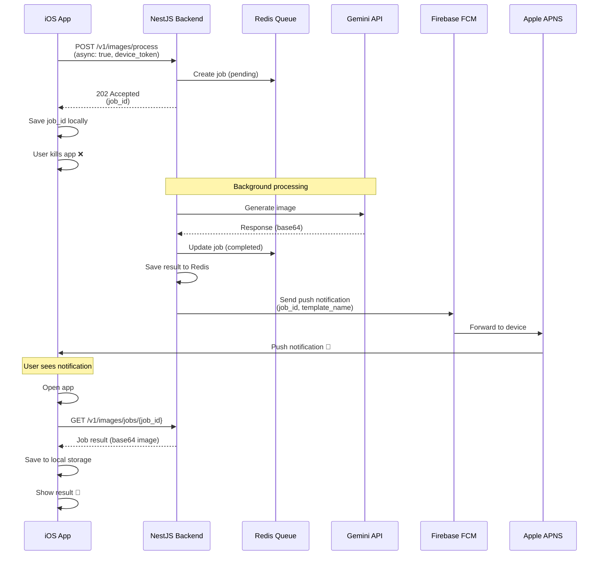

# Firebase Cloud Messaging (FCM) Integration Guide

**Last updated:** 2025-10-27  
**Status:** Planning  
**Purpose:** Push notifications cho image processing completion  

---

## Overview

Tích hợp Firebase Cloud Messaging (FCM) để gửi push notification khi image processing hoàn tất, cho phép user kill app và vẫn nhận được thông báo khi xong.

---

## Architecture

### System Flow



---

## Backend Implementation

### 1. Architecture Changes

#### New Components:
```
server/src/
├── jobs/
│   ├── jobs.module.ts
│   ├── jobs.service.ts
│   ├── jobs.controller.ts
│   ├── dto/
│   │   ├── create-job.dto.ts
│   │   ├── job-status.dto.ts
│   │   └── job-result.dto.ts
│   └── entities/
│       └── job.entity.ts
│
├── fcm/
│   ├── fcm.module.ts
│   ├── fcm.service.ts
│   └── dto/
│       └── send-notification.dto.ts
│
├── queue/
│   ├── queue.module.ts
│   ├── queue.service.ts
│   └── processors/
│       └── image-processing.processor.ts
│
└── images/
    ├── images.module.ts (updated)
    ├── images.controller.ts (updated)
    └── images.service.ts (updated)
```

---

### 2. Job Entity (Redis or DB)

```typescript
// server/src/jobs/entities/job.entity.ts
export enum JobStatus {
  PENDING = 'pending',
  PROCESSING = 'processing',
  COMPLETED = 'completed',
  FAILED = 'failed',
}

export interface Job {
  id: string;                    // UUID
  userId: string;                // Firebase UID
  templateId: string;            // Template UUID
  status: JobStatus;
  
  // Request data (not stored, only metadata)
  imageSize: number;             // Original image size in bytes
  requestedDimensions: {
    width: number;
    height: number;
  };
  
  // Result data
  processedImageBase64?: string; // Store in Redis with TTL 24h
  metadata?: {
    templateName: string;
    modelUsed: string;
    generationTimeMs: number;
    originalDimensions: { width: number; height: number };
    processedDimensions: { width: number; height: number };
  };
  
  // Error info
  errorCode?: string;
  errorMessage?: string;
  
  // Timestamps
  createdAt: Date;
  startedAt?: Date;
  completedAt?: Date;
  expiresAt: Date;              // Auto-delete after 24h
  
  // FCM
  deviceToken?: string;         // FCM device token
  notificationSent: boolean;
  notificationSentAt?: Date;
}
```

---

### 3. Redis Schema

```typescript
// Key structure
jobs:{jobId} = Job object (JSON)
jobs:user:{userId} = Set of jobIds
jobs:pending = Sorted set (score = createdAt timestamp)

// TTL
jobs:{jobId} → 24 hours
jobs:user:{userId} → 7 days

// Example
jobs:abc-123-def = {
  id: "abc-123-def",
  userId: "firebase-uid-xyz",
  templateId: "anime-style",
  status: "completed",
  processedImageBase64: "...",
  deviceToken: "fcm-token-...",
  createdAt: "2025-10-27T10:00:00Z",
  completedAt: "2025-10-27T10:00:15Z",
  expiresAt: "2025-10-28T10:00:00Z"
}
```

---

### 4. Jobs Service

```typescript
// server/src/jobs/jobs.service.ts
import { Injectable } from '@nestjs/common';
import { Redis } from 'ioredis';
import { v4 as uuidv4 } from 'uuid';

@Injectable()
export class JobsService {
  constructor(private readonly redis: Redis) {}

  async createJob(
    userId: string,
    templateId: string,
    imageSize: number,
    deviceToken?: string,
  ): Promise<Job> {
    const jobId = uuidv4();
    const now = new Date();
    const expiresAt = new Date(now.getTime() + 24 * 60 * 60 * 1000); // 24h

    const job: Job = {
      id: jobId,
      userId,
      templateId,
      status: JobStatus.PENDING,
      imageSize,
      deviceToken,
      notificationSent: false,
      createdAt: now,
      expiresAt,
    };

    // Store job
    await this.redis.setex(
      `jobs:${jobId}`,
      24 * 60 * 60, // 24h TTL
      JSON.stringify(job),
    );

    // Add to user's jobs set
    await this.redis.sadd(`jobs:user:${userId}`, jobId);

    // Add to pending queue
    await this.redis.zadd('jobs:pending', now.getTime(), jobId);

    return job;
  }

  async getJob(jobId: string): Promise<Job | null> {
    const data = await this.redis.get(`jobs:${jobId}`);
    return data ? JSON.parse(data) : null;
  }

  async updateJob(jobId: string, updates: Partial<Job>): Promise<void> {
    const job = await this.getJob(jobId);
    if (!job) throw new Error('Job not found');

    const updated = { ...job, ...updates };

    await this.redis.setex(
      `jobs:${jobId}`,
      24 * 60 * 60,
      JSON.stringify(updated),
    );

    // Update status in queue if needed
    if (updates.status === JobStatus.PROCESSING) {
      await this.redis.zrem('jobs:pending', jobId);
    }
  }

  async markCompleted(
    jobId: string,
    processedImageBase64: string,
    metadata: any,
  ): Promise<void> {
    await this.updateJob(jobId, {
      status: JobStatus.COMPLETED,
      processedImageBase64,
      metadata,
      completedAt: new Date(),
    });
  }

  async markFailed(jobId: string, error: Error): Promise<void> {
    await this.updateJob(jobId, {
      status: JobStatus.FAILED,
      errorCode: 'processing_failed',
      errorMessage: error.message,
      completedAt: new Date(),
    });
  }

  async getUserJobs(userId: string): Promise<Job[]> {
    const jobIds = await this.redis.smembers(`jobs:user:${userId}`);
    const jobs = await Promise.all(
      jobIds.map(id => this.getJob(id)),
    );
    return jobs.filter(job => job !== null) as Job[];
  }

  async getPendingJobs(limit: number = 10): Promise<Job[]> {
    const jobIds = await this.redis.zrange('jobs:pending', 0, limit - 1);
    const jobs = await Promise.all(
      jobIds.map(id => this.getJob(id)),
    );
    return jobs.filter(job => job !== null) as Job[];
  }
}
```

---

### 5. FCM Service

```typescript
// server/src/fcm/fcm.service.ts
import { Injectable, Logger } from '@nestjs/common';
import { ConfigService } from '@nestjs/config';
import * as admin from 'firebase-admin';

@Injectable()
export class FcmService {
  private readonly logger = new Logger(FcmService.name);

  constructor(private readonly configService: ConfigService) {
    // Firebase Admin should already be initialized in auth module
    // If not, initialize here
  }

  async sendJobCompletionNotification(
    deviceToken: string,
    jobId: string,
    templateName: string,
  ): Promise<boolean> {
    try {
      const message: admin.messaging.Message = {
        token: deviceToken,
        notification: {
          title: 'Image Ready! 🎨',
          body: `Your ${templateName} image has been processed`,
        },
        data: {
          type: 'job_completed',
          jobId,
          templateName,
        },
        apns: {
          payload: {
            aps: {
              sound: 'default',
              badge: 1,
              contentAvailable: true, // Wake app in background
              category: 'IMAGE_COMPLETE',
            },
          },
        },
      };

      const response = await admin.messaging().send(message);
      this.logger.log(`✅ FCM notification sent: ${response}`);
      return true;

    } catch (error) {
      this.logger.error(`❌ Failed to send FCM notification:`, error);
      return false;
    }
  }

  async sendJobFailedNotification(
    deviceToken: string,
    jobId: string,
    error: string,
  ): Promise<boolean> {
    try {
      const message: admin.messaging.Message = {
        token: deviceToken,
        notification: {
          title: 'Processing Failed',
          body: `Unable to process your image: ${error}`,
        },
        data: {
          type: 'job_failed',
          jobId,
          error,
        },
        apns: {
          payload: {
            aps: {
              sound: 'default',
              badge: 1,
            },
          },
        },
      };

      await admin.messaging().send(message);
      return true;

    } catch (error) {
      this.logger.error(`❌ Failed to send failure notification:`, error);
      return false;
    }
  }
}
```

---

### 6. Queue Processor (BullMQ)

```typescript
// server/src/queue/processors/image-processing.processor.ts
import { Processor, WorkerHost } from '@nestjs/bullmq';
import { Job } from 'bullmq';
import { Logger } from '@nestjs/common';
import { GeminiService } from '../../gemini/gemini.service';
import { JobsService } from '../../jobs/jobs.service';
import { FcmService } from '../../fcm/fcm.service';

interface ImageProcessingJobData {
  jobId: string;
  templateId: string;
  imageBase64: string;
  options?: {
    width?: number;
    height?: number;
    quality?: string;
  };
}

@Processor('image-processing')
export class ImageProcessingProcessor extends WorkerHost {
  private readonly logger = new Logger(ImageProcessingProcessor.name);

  constructor(
    private readonly geminiService: GeminiService,
    private readonly jobsService: JobsService,
    private readonly fcmService: FcmService,
  ) {
    super();
  }

  async process(job: Job<ImageProcessingJobData>): Promise<void> {
    const { jobId, templateId, imageBase64, options } = job.data;

    this.logger.log(`Processing job ${jobId}...`);

    // Update job status
    await this.jobsService.updateJob(jobId, {
      status: 'processing',
      startedAt: new Date(),
    });

    try {
      // Get template
      const template = await this.getTemplate(templateId);

      // Call Gemini API
      const result = await this.geminiService.generateImage({
        prompt: template.prompt,
        negativePrompt: template.negativePrompt,
        imageBase64,
        width: options?.width,
        height: options?.height,
        quality: options?.quality as any,
      });

      // Mark job completed
      await this.jobsService.markCompleted(
        jobId,
        result.processedImageBase64,
        {
          templateName: template.name,
          modelUsed: result.metadata.modelUsed,
          generationTimeMs: result.metadata.generationTimeMs,
          processedDimensions: result.metadata.dimensions,
        },
      );

      // Send push notification
      const jobData = await this.jobsService.getJob(jobId);
      if (jobData?.deviceToken) {
        const sent = await this.fcmService.sendJobCompletionNotification(
          jobData.deviceToken,
          jobId,
          template.name,
        );

        if (sent) {
          await this.jobsService.updateJob(jobId, {
            notificationSent: true,
            notificationSentAt: new Date(),
          });
        }
      }

      this.logger.log(`✅ Job ${jobId} completed successfully`);

    } catch (error) {
      this.logger.error(`❌ Job ${jobId} failed:`, error);

      // Mark job failed
      await this.jobsService.markFailed(jobId, error);

      // Send failure notification
      const jobData = await this.jobsService.getJob(jobId);
      if (jobData?.deviceToken) {
        await this.fcmService.sendJobFailedNotification(
          jobData.deviceToken,
          jobId,
          error.message,
        );
      }

      throw error; // Let BullMQ handle retry
    }
  }

  private async getTemplate(templateId: string) {
    // Get from database
    // Return { name, prompt, negativePrompt }
  }
}
```

---

### 7. Updated Images Controller

```typescript
// server/src/images/images.controller.ts
import { Controller, Post, Get, Body, Param, UseGuards } from '@nestjs/common';
import { Queue } from 'bullmq';
import { InjectQueue } from '@nestjs/bullmq';
import { BearerAuthGuard } from '../auth/bearer-auth.guard';
import { CurrentUser } from '../auth/current-user.decorator';
import { JobsService } from '../jobs/jobs.service';

@Controller('v1/images')
@UseGuards(BearerAuthGuard)
export class ImagesController {
  constructor(
    @InjectQueue('image-processing') private readonly queue: Queue,
    private readonly jobsService: JobsService,
  ) {}

  @Post('process')
  async processImage(
    @CurrentUser() user: any,
    @Body() dto: ProcessImageDto,
  ) {
    // Validate image
    const validation = this.validateImage(dto.image_base64);
    if (!validation.valid) {
      throw new BadRequestException(validation.error);
    }

    // Create job
    const job = await this.jobsService.createJob(
      user.uid,
      dto.template_id,
      validation.sizeBytes,
      dto.device_token, // Optional FCM token
    );

    // Add to queue for async processing
    await this.queue.add('process-image', {
      jobId: job.id,
      templateId: dto.template_id,
      imageBase64: dto.image_base64,
      options: dto.options,
    });

    // Return job ID immediately
    return {
      success: true,
      data: {
        job_id: job.id,
        status: 'pending',
        estimated_time_seconds: 15,
        message: 'Processing started. You will receive a notification when complete.',
      },
      meta: {
        requestId: crypto.randomUUID(),
        timestamp: new Date().toISOString(),
      },
    };
  }

  @Get('jobs/:jobId')
  async getJobStatus(
    @CurrentUser() user: any,
    @Param('jobId') jobId: string,
  ) {
    const job = await this.jobsService.getJob(jobId);

    if (!job) {
      throw new NotFoundException('Job not found');
    }

    if (job.userId !== user.uid) {
      throw new ForbiddenException('Access denied');
    }

    // Return job status
    return {
      success: true,
      data: {
        job_id: job.id,
        status: job.status,
        created_at: job.createdAt,
        completed_at: job.completedAt,
        
        // Only include result if completed
        ...(job.status === 'completed' && {
          result: {
            processed_image_base64: `data:image/jpeg;base64,${job.processedImageBase64}`,
            metadata: job.metadata,
          },
        }),
        
        // Include error if failed
        ...(job.status === 'failed' && {
          error: {
            code: job.errorCode,
            message: job.errorMessage,
          },
        }),
      },
      meta: {
        requestId: crypto.randomUUID(),
        timestamp: new Date().toISOString(),
      },
    };
  }

  @Get('jobs')
  async getUserJobs(@CurrentUser() user: any) {
    const jobs = await this.jobsService.getUserJobs(user.uid);

    return {
      success: true,
      data: {
        jobs: jobs.map(job => ({
          job_id: job.id,
          status: job.status,
          template_id: job.templateId,
          created_at: job.createdAt,
          completed_at: job.completedAt,
        })),
      },
    };
  }
}
```

---

## iOS Implementation

### 1. FCM SDK Setup

```swift
// Podfile
pod 'FirebaseMessaging'

// AppDelegate.swift
import FirebaseMessaging

class AppDelegate: NSObject, UIApplicationDelegate, MessagingDelegate {
    func application(_ application: UIApplication,
                     didFinishLaunchingWithOptions launchOptions: [UIApplication.LaunchOptionsKey: Any]?) -> Bool {
        
        // Configure FCM
        Messaging.messaging().delegate = self
        
        // Request notification permission
        UNUserNotificationCenter.current().requestAuthorization(options: [.alert, .badge, .sound]) { granted, error in
            print("✅ Notification permission: \(granted)")
        }
        
        application.registerForRemoteNotifications()
        
        return true
    }
    
    // MARK: - FCM Delegates
    
    func messaging(_ messaging: Messaging, didReceiveRegistrationToken fcmToken: String?) {
        print("✅ FCM Token: \(fcmToken ?? "nil")")
        
        // Save token for API calls
        UserDefaults.standard.set(fcmToken, forKey: "fcmToken")
        
        // Send to backend if user logged in
        if let userId = Auth.auth().currentUser?.uid {
            Task {
                await updateDeviceToken(fcmToken)
            }
        }
    }
    
    private func updateDeviceToken(_ token: String?) async {
        // Send to backend
        // POST /v1/users/device-token
    }
}
```

---

### 2. Handle Push Notifications

```swift
// AppDelegate.swift
extension AppDelegate: UNUserNotificationCenterDelegate {
    
    // Called when notification received while app in foreground
    func userNotificationCenter(
        _ center: UNUserNotificationCenter,
        willPresent notification: UNNotification,
        withCompletionHandler completionHandler: @escaping (UNNotificationPresentationOptions) -> Void
    ) {
        let userInfo = notification.request.content.userInfo
        
        if let type = userInfo["type"] as? String,
           type == "job_completed" {
            // Show banner even when app is open
            completionHandler([.banner, .sound, .badge])
        } else {
            completionHandler([])
        }
    }
    
    // Called when user taps notification
    func userNotificationCenter(
        _ center: UNUserNotificationCenter,
        didReceive response: UNNotificationResponse,
        withCompletionHandler completionHandler: @escaping () -> Void
    ) {
        let userInfo = response.notification.request.content.userInfo
        
        guard let type = userInfo["type"] as? String,
              let jobId = userInfo["jobId"] as? String else {
            completionHandler()
            return
        }
        
        switch type {
        case "job_completed":
            // Fetch job result and save
            Task {
                await handleJobCompletion(jobId: jobId)
                completionHandler()
            }
            
        case "job_failed":
            // Show error
            NotificationCenter.default.post(
                name: .jobFailed,
                object: nil,
                userInfo: ["jobId": jobId]
            )
            completionHandler()
            
        default:
            completionHandler()
        }
    }
    
    private func handleJobCompletion(jobId: String) async {
        do {
            // Fetch job result
            let result = try await ImageProcessingAPIClient.shared.getJobResult(jobId: jobId)
            
            // Decode image
            guard let imageData = Data(base64Encoded: result.processedImageBase64),
                  let processedImage = UIImage(data: imageData) else {
                return
            }
            
            // Get original image (saved when job created)
            guard let originalImage = loadOriginalImage(forJob: jobId) else {
                return
            }
            
            // Save project
            let project = ProjectsStorageManager.shared.saveProject(
                templateId: result.metadata.templateId,
                templateName: result.metadata.templateName,
                originalImage: originalImage,
                processedImage: processedImage,
                metadata: result.metadata
            )
            
            // Clean up temporary data
            cleanupJobData(jobId: jobId)
            
            // Notify app
            NotificationCenter.default.post(
                name: .jobCompleted,
                object: nil,
                userInfo: ["jobId": jobId, "project": project as Any]
            )
            
        } catch {
            print("❌ Failed to handle job completion: \(error)")
        }
    }
}

extension Notification.Name {
    static let jobCompleted = Notification.Name("jobCompleted")
    static let jobFailed = Notification.Name("jobFailed")
}
```

---

### 3. Updated ViewModel

```swift
// ImageProcessingViewModel.swift
@Observable
class ImageProcessingViewModel {
    var processingState: ProcessingState = .idle
    var currentJobId: String?
    var progress: Double = 0.0
    
    enum ProcessingState {
        case idle
        case uploading
        case processing(jobId: String)
        case completed
        case failed(Error)
    }
    
    init() {
        // Listen for push notification events
        NotificationCenter.default.addObserver(
            self,
            selector: #selector(handleJobCompleted),
            name: .jobCompleted,
            object: nil
        )
        
        NotificationCenter.default.addObserver(
            self,
            selector: #selector(handleJobFailed),
            name: .jobFailed,
            object: nil
        )
        
        // Check for pending jobs
        checkPendingJobs()
    }
    
    func processImage(template: Template, originalImage: UIImage) async {
        processingState = .uploading
        progress = 0.1
        
        // Compress image
        guard let compressed = originalImage.compressForUpload() else {
            processingState = .failed(ProcessingError.compressionFailed)
            return
        }
        let base64 = compressed.base64EncodedString()
        progress = 0.2
        
        // Get FCM token
        let fcmToken = UserDefaults.standard.string(forKey: "fcmToken")
        
        // Get auth token
        guard let authToken = await AuthService.shared.getToken() else {
            processingState = .failed(ProcessingError.unauthorized)
            return
        }
        
        do {
            // Call API (returns immediately with job_id)
            let response = try await ImageProcessingAPIClient.shared.processImageAsync(
                templateId: template.id,
                imageBase64: "data:image/jpeg;base64,\(base64)",
                deviceToken: fcmToken,
                authToken: authToken
            )
            
            let jobId = response.jobId
            currentJobId = jobId
            processingState = .processing(jobId: jobId)
            progress = 0.3
            
            // Save original image temporarily (for when notification arrives)
            saveOriginalImageForJob(jobId: jobId, image: originalImage, template: template)
            
            // Start polling as backup (in case push fails)
            startPollingJob(jobId: jobId)
            
        } catch {
            processingState = .failed(error)
        }
    }
    
    private func startPollingJob(jobId: String) {
        Task {
            // Poll every 3 seconds as backup
            for _ in 0..<20 { // Max 60 seconds
                try? await Task.sleep(for: .seconds(3))
                
                guard case .processing = processingState else {
                    return // Job completed via push
                }
                
                do {
                    let status = try await ImageProcessingAPIClient.shared.getJobStatus(jobId: jobId)
                    
                    switch status.status {
                    case "completed":
                        // Handle completion (push might have failed)
                        await handleJobCompletionFromPolling(jobId: jobId, result: status.result)
                        return
                        
                    case "failed":
                        processingState = .failed(ProcessingError.apiError(status.error?.message ?? "Unknown"))
                        return
                        
                    default:
                        // Still processing
                        progress = min(0.9, progress + 0.05)
                    }
                } catch {
                    // Ignore polling errors
                    print("⚠️ Polling error: \(error)")
                }
            }
            
            // Timeout
            processingState = .failed(ProcessingError.timeout)
        }
    }
    
    @objc private func handleJobCompleted(_ notification: Notification) {
        guard let jobId = notification.userInfo?["jobId"] as? String,
              jobId == currentJobId else { return }
        
        progress = 1.0
        processingState = .completed
    }
    
    @objc private func handleJobFailed(_ notification: Notification) {
        guard let jobId = notification.userInfo?["jobId"] as? String,
              jobId == currentJobId else { return }
        
        processingState = .failed(ProcessingError.processingFailed)
    }
    
    private func checkPendingJobs() {
        // Check UserDefaults for pending jobs
        guard let pending = UserDefaults.standard.dictionary(forKey: "pendingJobs"),
              !pending.isEmpty else { return }
        
        // Resume polling for pending jobs
        for (jobId, _) in pending {
            startPollingJob(jobId: jobId)
        }
    }
}
```

---

## Configuration

### Environment Variables

```bash
# Backend .env
REDIS_HOST=localhost
REDIS_PORT=6379
REDIS_PASSWORD=

# BullMQ
BULLMQ_REDIS_HOST=localhost
BULLMQ_REDIS_PORT=6379

# FCM (already configured for Firebase Auth)
FIREBASE_PROJECT_ID=your-project
FIREBASE_CLIENT_EMAIL=...
FIREBASE_PRIVATE_KEY=...
```

### iOS Info.plist

```xml
<key>FirebaseAppDelegateProxyEnabled</key>
<false/>
<key>UIBackgroundModes</key>
<array>
    <string>remote-notification</string>
</array>
```

---

## Testing

### Backend Tests

```typescript
describe('Image Processing with FCM', () => {
  it('should create job and return job_id', async () => {
    const response = await request(app.getHttpServer())
      .post('/v1/images/process')
      .set('Authorization', `Bearer ${token}`)
      .send({
        template_id: 'test-template',
        image_base64: 'data:image/jpeg;base64,...',
        device_token: 'fcm-token-123'
      });
    
    expect(response.status).toBe(202);
    expect(response.body.data.job_id).toBeDefined();
  });
  
  it('should send FCM notification when job completes', async () => {
    // Mock FCM
    // Process job
    // Verify notification sent
  });
});
```

### iOS Tests

```swift
func testProcessImageAsync() async throws {
    let viewModel = ImageProcessingViewModel()
    
    await viewModel.processImage(template: testTemplate, originalImage: testImage)
    
    XCTAssertEqual(viewModel.processingState, .processing(jobId: "..."))
    XCTAssertNotNil(viewModel.currentJobId)
}

func testHandlePushNotification() {
    // Simulate push notification
    // Verify job completion handled
}
```

---

## Monitoring & Alerts

### Metrics to Track

- Job creation rate
- Job completion rate
- Average processing time
- Failed jobs rate
- FCM delivery rate
- Polling vs Push completion ratio

### Alerts

- 🚨 Job failure rate > 5%
- 🚨 FCM delivery rate < 95%
- 🚨 Average processing time > 30s
- ⚠️ Redis memory usage > 80%
- ⚠️ Queue size > 100 jobs

---

## Cost Estimation

### FCM
- **Free:** 1 million messages/month
- **Paid:** $0.12 per 1,000 messages after limit

### Redis
- **Option 1:** Redis Cloud (free 30MB, $5/month for 250MB)
- **Option 2:** Self-hosted on DigitalOcean ($6/month)
- **Option 3:** AWS ElastiCache ($15/month)

### Total Monthly Cost
- **< 1,000 users:** $0 (FCM free tier)
- **10,000 users:** ~$10-20 (Redis + FCM)
- **100,000 users:** ~$50-100 (Redis + FCM + scaling)

---

## Migration Plan

### Phase 1: Add FCM (Week 1)
- [ ] Setup Redis
- [ ] Implement job queue
- [ ] Add FCM service
- [ ] Update API endpoints
- [ ] Deploy to staging

### Phase 2: iOS Integration (Week 1)
- [ ] Add FCM SDK
- [ ] Implement push handlers
- [ ] Update ViewModel
- [ ] Test end-to-end

### Phase 3: Monitoring (Week 2)
- [ ] Add metrics
- [ ] Setup alerts
- [ ] Load testing
- [ ] Production deployment

---

## Rollout Strategy

1. **Beta Testing (100 users):** Test push notification delivery
2. **Gradual Rollout (25% → 50% → 100%):** Monitor error rates
3. **Fallback:** Keep polling as backup if FCM fails

---

## References

- [FCM Documentation](https://firebase.google.com/docs/cloud-messaging)
- [BullMQ Guide](https://docs.bullmq.io/)
- [Redis Best Practices](https://redis.io/docs/manual/patterns/)
- [iOS Push Notifications](https://developer.apple.com/documentation/usernotifications)

