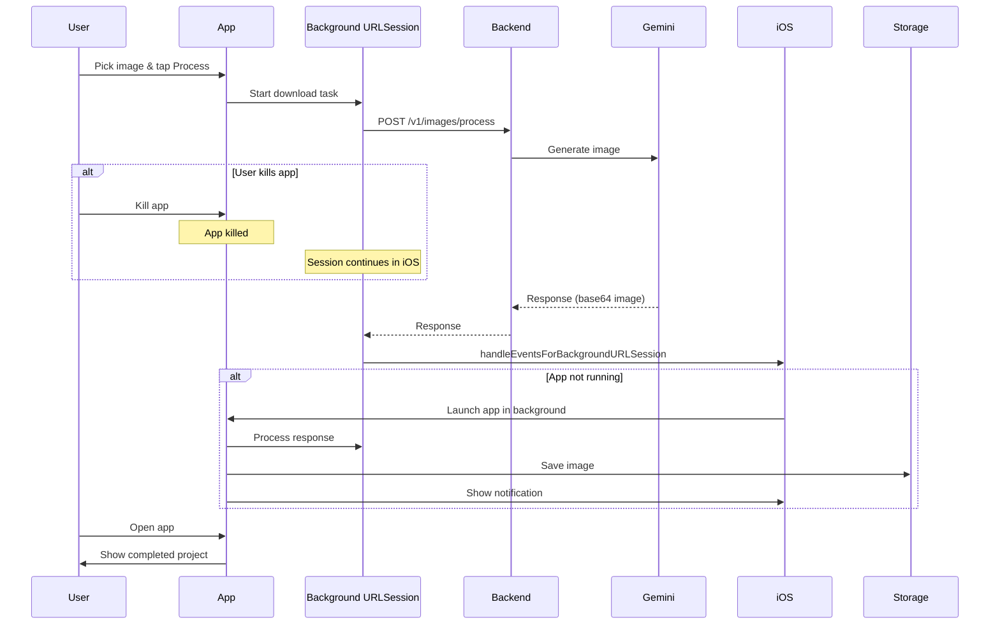

# iOS Background Processing Strategy

**Last updated:** 2025-10-27  
**Status:** Planning  
**Component:** Image Processing  

---

## Overview

Chiến lược xử lý background cho image processing, cho phép user kill app hoặc switch app mà vẫn nhận được kết quả khi mở lại.

---

## Problem Statement

### Scenarios cần handle:

1. **Kill App (Swipe Up)**
   - User đang process image
   - User kill app (swipe up from app switcher)
   - HTTP connection bị đứt
   - User mở lại app → Cần restore state

2. **Background (Press Home)**
   - User đang process image
   - User press Home button → app vào background
   - iOS cho ~30 seconds background time
   - Nếu processing > 30s → app bị suspend

3. **Lock Screen**
   - Tương tự scenario 2

4. **System Kill (Low Memory)**
   - iOS kill app do low memory
   - User không biết app đã bị kill
   - User mở lại → cần restore gracefully

---

## Solution: Background URL Session

### Why Background URL Session?

| Feature | Standard URLSession | Background URLSession |
|---------|-------------------|---------------------|
| Works when app killed | ❌ No | ✅ Yes |
| Works when backgrounded | ⚠️ Only ~30s | ✅ Yes (unlimited) |
| Works when suspended | ❌ No | ✅ Yes |
| Requires backend changes | ❌ No | ❌ No |
| Upload progress | ✅ Yes | ❌ No (only download) |
| Download progress | ✅ Yes | ✅ Yes |
| Complexity | ⭐ Simple | ⭐⭐ Medium |

**Decision:** Use Background URLSession for image processing requests.

---

## Architecture

### Flow Diagram



---

## Implementation

### 1. Background Session Configuration

```swift
// BackgroundImageProcessor.swift
class BackgroundImageProcessor: NSObject {
    static let shared = BackgroundImageProcessor()
    
    private var session: URLSession!
    private let sessionIdentifier = "com.aiimagestylist.processing"
    
    override init() {
        super.init()
        
        // Configure background session
        let config = URLSessionConfiguration.background(
            withIdentifier: sessionIdentifier
        )
        
        // Important settings
        config.isDiscretionary = false              // Don't wait for optimal conditions
        config.sessionSendsLaunchEvents = true      // Wake app when complete
        config.timeoutIntervalForRequest = 60       // 60s timeout
        config.timeoutIntervalForResource = 300     // 5 minutes max
        config.httpMaximumConnectionsPerHost = 1    // One at a time
        
        // Create session with delegate
        session = URLSession(
            configuration: config,
            delegate: self,
            delegateQueue: nil  // Use background thread
        )
    }
}
```

### 2. Request Execution

```swift
// BackgroundImageProcessor.swift
extension BackgroundImageProcessor {
    func processImage(
        templateId: String,
        originalImage: UIImage,
        imageBase64: String,
        token: String
    ) -> String {
        // Generate unique request ID
        let requestId = UUID().uuidString
        
        // Build request
        var request = URLRequest(url: URL(string: "\(API_BASE_URL)/v1/images/process")!)
        request.httpMethod = "POST"
        request.setValue("Bearer \(token)", forHTTPHeaderField: "Authorization")
        request.setValue("application/json", forHTTPHeaderField: "Content-Type")
        request.setValue(requestId, forHTTPHeaderField: "X-Request-ID")
        
        let body: [String: Any] = [
            "template_id": templateId,
            "image_base64": imageBase64
        ]
        request.httpBody = try? JSONSerialization.data(withJSONObject: body)
        
        // Store pending task info
        savePendingTask(
            requestId: requestId,
            templateId: templateId,
            originalImage: originalImage
        )
        
        // Create background download task
        // Note: Must be download task, not data task for background support
        let task = session.downloadTask(with: request)
        task.taskDescription = requestId
        task.resume()
        
        return requestId
    }
    
    private func savePendingTask(
        requestId: String,
        templateId: String,
        originalImage: UIImage
    ) {
        // Save image to temporary file
        let tempDir = FileManager.default.temporaryDirectory
        let imageFile = tempDir.appendingPathComponent("\(requestId)-original.jpg")
        try? originalImage.jpegData(compressionQuality: 0.8)?.write(to: imageFile)
        
        // Save metadata to UserDefaults
        var pending = UserDefaults.standard.dictionary(forKey: "pendingTasks") ?? [:]
        pending[requestId] = [
            "templateId": templateId,
            "originalImagePath": imageFile.path,
            "startedAt": Date().timeIntervalSince1970
        ]
        UserDefaults.standard.set(pending, forKey: "pendingTasks")
    }
}
```

### 3. Response Handling

```swift
// BackgroundImageProcessor.swift
extension BackgroundImageProcessor: URLSessionDelegate, URLSessionDownloadDelegate {
    
    // Called when download completes
    func urlSession(
        _ session: URLSession,
        downloadTask: URLSessionDownloadTask,
        didFinishDownloadingTo location: URL
    ) {
        guard let requestId = downloadTask.taskDescription else { return }
        
        do {
            // Read response data
            let data = try Data(contentsOf: location)
            
            // Parse response
            let response = try JSONDecoder().decode(ProcessImageResponse.self, from: data)
            
            // Get original image
            guard let taskInfo = getPendingTask(requestId: requestId),
                  let originalImage = loadOriginalImage(from: taskInfo) else {
                print("❌ Failed to load original image")
                return
            }
            
            // Decode processed image
            let base64 = response.data.processedImageBase64
                .replacingOccurrences(of: "data:image/jpeg;base64,", with: "")
            
            guard let imageData = Data(base64Encoded: base64),
                  let processedImage = UIImage(data: imageData) else {
                print("❌ Failed to decode processed image")
                return
            }
            
            // Save project to local storage
            let project = ProjectsStorageManager.shared.saveProject(
                templateId: taskInfo["templateId"] as! String,
                templateName: response.data.metadata.templateName,
                originalImage: originalImage,
                processedImage: processedImage,
                metadata: response.data.metadata
            )
            
            // Clean up pending task
            clearPendingTask(requestId: requestId)
            
            // Notify app
            notifyCompletion(requestId: requestId, project: project)
            
            // Show notification if app in background
            if UIApplication.shared.applicationState != .active {
                showLocalNotification(
                    templateName: response.data.metadata.templateName
                )
            }
            
        } catch {
            print("❌ Failed to process response: \(error)")
            notifyError(requestId: requestId, error: error)
        }
    }
    
    // Called when task completes (success or error)
    func urlSession(
        _ session: URLSession,
        task: URLSessionTask,
        didCompleteWithError error: Error?
    ) {
        guard let requestId = task.taskDescription else { return }
        
        if let error = error {
            clearPendingTask(requestId: requestId)
            notifyError(requestId: requestId, error: error)
        }
    }
    
    // iOS calls this when all background events processed
    func urlSessionDidFinishEvents(forBackgroundURLSession session: URLSession) {
        DispatchQueue.main.async {
            // Call saved completion handler
            if let appDelegate = UIApplication.shared.delegate as? AppDelegate,
               let completionHandler = appDelegate.backgroundCompletionHandler {
                completionHandler()
            }
        }
    }
}
```

### 4. App Lifecycle Integration

```swift
// AppDelegate.swift
class AppDelegate: UIApplicationDelegate {
    var backgroundCompletionHandler: (() -> Void)?
    
    func application(
        _ application: UIApplication,
        handleEventsForBackgroundURLSession identifier: String,
        completionHandler: @escaping () -> Void
    ) {
        print("✅ Background URLSession event: \(identifier)")
        
        // Save completion handler
        backgroundCompletionHandler = completionHandler
        
        // Background processor will call this when done
    }
}
```

### 5. ViewModel Integration

```swift
// ImageProcessingViewModel.swift
@Observable
class ImageProcessingViewModel {
    var processingState: ProcessingState = .idle
    var currentRequestId: String?
    
    enum ProcessingState {
        case idle
        case processing
        case processingInBackground  // New state
        case completed
        case failed(Error)
    }
    
    init() {
        // Listen for background completion
        NotificationCenter.default.addObserver(
            self,
            selector: #selector(handleBackgroundCompletion),
            name: .imageProcessingCompleted,
            object: nil
        )
        
        // Check for pending tasks on init
        checkPendingTasks()
    }
    
    func processImage(template: Template, originalImage: UIImage) async {
        // Compress image
        guard let compressed = originalImage.compressForUpload() else { return }
        let base64 = compressed.base64EncodedString()
        
        // Get auth token
        guard let token = await AuthService.shared.getToken() else { return }
        
        // Start background processing
        let requestId = BackgroundImageProcessor.shared.processImage(
            templateId: template.id,
            originalImage: originalImage,
            imageBase64: "data:image/jpeg;base64,\(base64)",
            token: token
        )
        
        currentRequestId = requestId
        processingState = .processing
    }
    
    private func checkPendingTasks() {
        guard let pending = UserDefaults.standard.dictionary(forKey: "pendingTasks"),
              !pending.isEmpty else { return }
        
        // There are pending tasks from previous session
        processingState = .processingInBackground
        
        // Show message: "Processing from previous session..."
    }
    
    @objc private func handleBackgroundCompletion(_ notification: Notification) {
        guard let requestId = notification.userInfo?["requestId"] as? String,
              requestId == currentRequestId else { return }
        
        processingState = .completed
    }
}
```

### 6. Local Notification

```swift
// BackgroundImageProcessor.swift
extension BackgroundImageProcessor {
    private func showLocalNotification(templateName: String) {
        let content = UNMutableNotificationContent()
        content.title = "Image Ready! 🎨"
        content.body = "Your \(templateName) image has been processed"
        content.sound = .default
        content.badge = NSNumber(value: 1)
        
        // Add action buttons
        content.categoryIdentifier = "IMAGE_COMPLETE"
        
        let request = UNNotificationRequest(
            identifier: UUID().uuidString,
            content: content,
            trigger: nil  // Show immediately
        )
        
        UNUserNotificationCenter.current().add(request) { error in
            if let error = error {
                print("❌ Failed to show notification: \(error)")
            }
        }
    }
    
    // Setup notification categories
    static func setupNotificationCategories() {
        let viewAction = UNNotificationAction(
            identifier: "VIEW_IMAGE",
            title: "View",
            options: .foreground
        )
        
        let category = UNNotificationCategory(
            identifier: "IMAGE_COMPLETE",
            actions: [viewAction],
            intentIdentifiers: []
        )
        
        UNUserNotificationCenter.current().setNotificationCategories([category])
    }
}
```

---

## User Experience

### UI States

```swift
// ProcessingStatusView.swift
struct ProcessingStatusView: View {
    @State private var viewModel: ImageProcessingViewModel
    
    var body: some View {
        VStack {
            switch viewModel.processingState {
            case .idle:
                EmptyView()
                
            case .processing:
                VStack {
                    ProgressView()
                    Text("Processing your image...")
                    Text("This may take 10-30 seconds")
                        .font(.caption)
                        .foregroundStyle(.secondary)
                    Text("You can close the app and come back later")
                        .font(.caption2)
                        .foregroundStyle(.tertiary)
                }
                
            case .processingInBackground:
                VStack {
                    ProgressView()
                    Text("Continuing from previous session...")
                    Text("Almost done!")
                        .font(.caption)
                }
                
            case .completed:
                VStack {
                    Image(systemName: "checkmark.circle.fill")
                        .font(.largeTitle)
                        .foregroundStyle(.green)
                    Text("Done!")
                }
                
            case .failed(let error):
                VStack {
                    Image(systemName: "exclamationmark.triangle.fill")
                        .font(.largeTitle)
                        .foregroundStyle(.red)
                    Text("Failed: \(error.localizedDescription)")
                }
            }
        }
    }
}
```

---

## Edge Cases & Handling

### 1. Device Restart
**Scenario:** User restart device while processing  
**Handling:** Background session is cleared by iOS  
**Action:** Show "Processing was interrupted" message, allow retry

### 2. Network Change (WiFi → Cellular)
**Scenario:** User switch from WiFi to cellular  
**Handling:** URLSession automatically handles reconnection  
**Action:** No action needed, iOS handles it

### 3. Backend Timeout
**Scenario:** Backend takes > 60s  
**Handling:** URLSession timeout fires  
**Action:** Show error, allow retry

### 4. Multiple Concurrent Requests
**Scenario:** User start processing, kill app, open and start another  
**Handling:** Track all pending tasks by requestId  
**Action:** Process all completions, show most recent first

### 5. Old Pending Tasks (> 24 hours)
**Scenario:** User abandon processing for days  
**Handling:** Clean up on app launch  
**Action:** Remove tasks older than 24 hours

```swift
func cleanupOldPendingTasks() {
    guard var pending = UserDefaults.standard.dictionary(forKey: "pendingTasks") else { return }
    
    let now = Date().timeIntervalSince1970
    let maxAge: TimeInterval = 24 * 60 * 60 // 24 hours
    
    for (requestId, info) in pending {
        guard let startedAt = (info as? [String: Any])?["startedAt"] as? TimeInterval else { continue }
        
        if now - startedAt > maxAge {
            // Remove old task
            pending.removeValue(forKey: requestId)
            
            // Clean up temp files
            if let imagePath = (info as? [String: Any])?["originalImagePath"] as? String {
                try? FileManager.default.removeItem(atPath: imagePath)
            }
        }
    }
    
    UserDefaults.standard.set(pending, forKey: "pendingTasks")
}
```

---

## Testing

### Test Cases

1. **Kill App During Processing**
   - Start processing
   - Kill app (swipe up)
   - Wait 30s
   - Open app
   - ✅ Should show "continuing..." and complete

2. **Background App**
   - Start processing
   - Press Home
   - Wait for completion
   - ✅ Should receive notification
   - Open app
   - ✅ Should show completed

3. **Lock Screen**
   - Start processing
   - Lock device
   - Wait for completion
   - ✅ Should show notification on lock screen

4. **Network Loss**
   - Start processing
   - Turn off WiFi mid-request
   - ✅ Should show timeout error

5. **Multiple Sessions**
   - Start processing (request A)
   - Kill app
   - Open app
   - Start another processing (request B)
   - ✅ Both should complete independently

---

## Limitations & Trade-offs

### Limitations

1. **No Upload Progress**
   - Background sessions don't support upload progress
   - Can only show indeterminate progress during upload

2. **No Real-time Updates**
   - Can't stream progress during processing
   - User sees "processing..." until done

3. **Device Restart**
   - Background session cleared on device restart
   - Pending tasks lost

### Acceptable for MVP

These limitations are acceptable because:
- ✅ Processing takes 10-30s (not hours)
- ✅ Most users won't restart device during processing
- ✅ Notification provides good feedback
- ✅ Can upgrade to polling/push in Phase 2

---

## Phase 2 Enhancements

### Push Notifications
- Backend sends push when processing completes
- Better than polling
- Works even after device restart

### Job Queue + Polling
- Backend tracks job state
- iOS can query job status anytime
- Survives device restart

### Retry Logic
- Auto-retry failed requests
- Exponential backoff
- Show retry count to user

---

## References

- [Apple URLSession Documentation](https://developer.apple.com/documentation/foundation/urlsession)
- [Background Execution Guide](https://developer.apple.com/documentation/uikit/app_and_environment/scenes/preparing_your_ui_to_run_in_the_background)
- [Local Notifications Guide](https://developer.apple.com/documentation/usernotifications)

