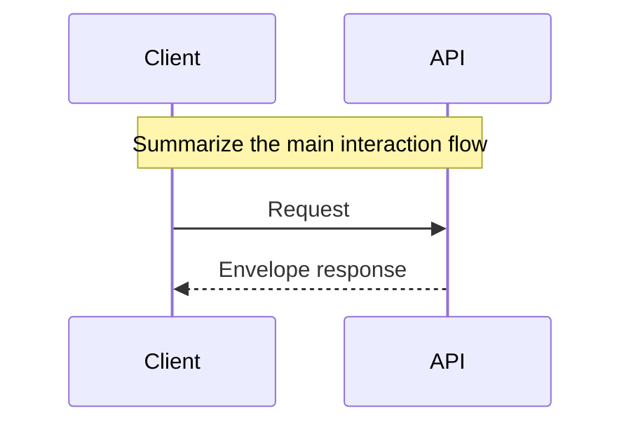

# <Feature> Spec

Status: Draft|Stable  
Version: x.y  
Updated: YYYY-MM-DD  
Owner: @you

Purpose & Scope
- What this feature solves and its boundaries.
- Non-goals.

Sources of Truth
- Swagger: path/to/endpoint(s)
- Code paths: path/to/files
- DB/Migrations: 000x_*.sql
- Related specs: link to other docs in .documents

Main Flow (Mermaid)

Business Rules
- Explicit, testable rules here.
- Validation and error mapping to envelope error codes.

Related API (summary)
- List endpoints and link to Swagger for payload details.

Acceptance
- [ ] Behavior covered by unit/integration tests
- [ ] Envelope format respected (success/data|error/meta)
- [ ] Edge cases handled (list)
- [ ] Docs updated (this spec + Swagger)

Changelog
- YYYY-MM-DD: Initial draft
