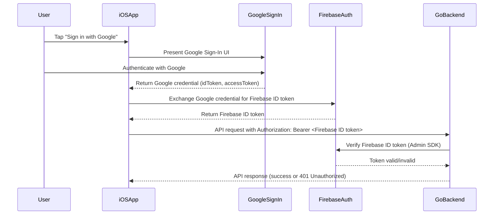
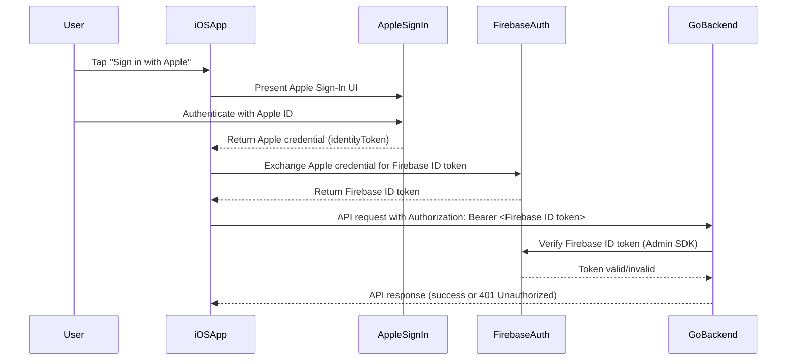
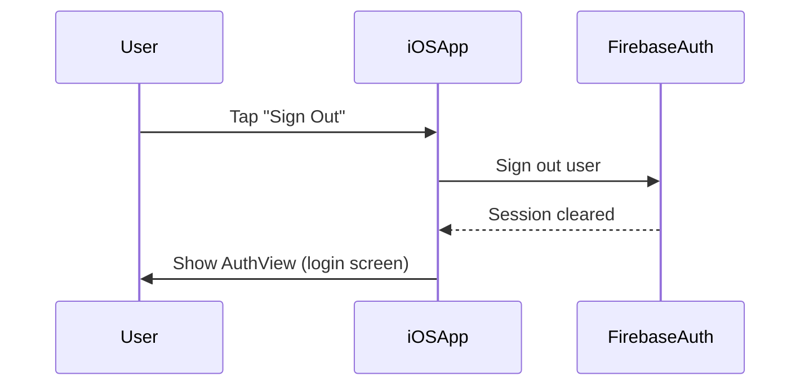
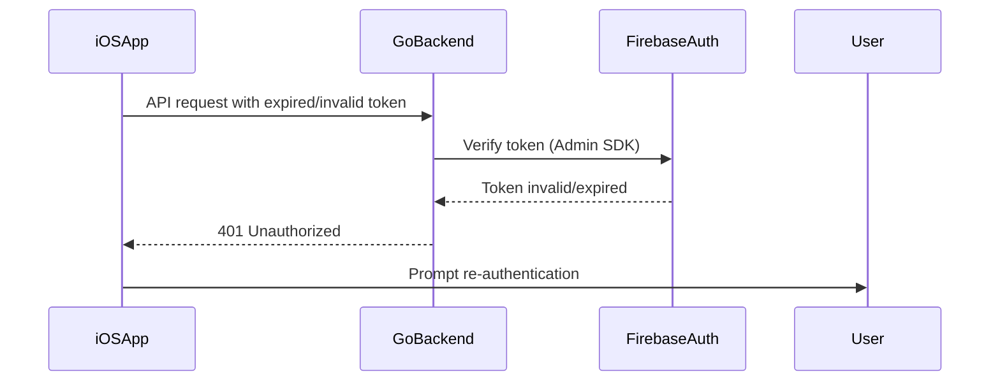
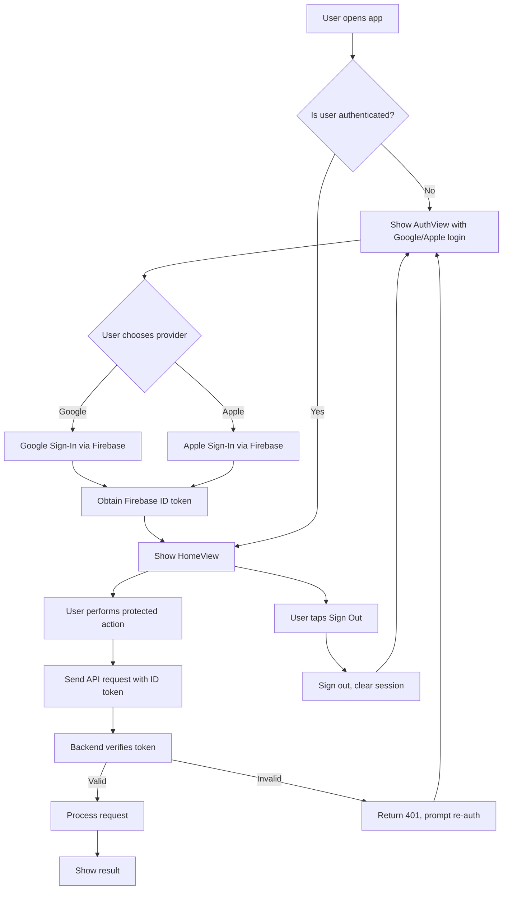

# Use Case: Authentication (Google/Apple Login via Firebase Auth)

## 1. Overview

This document details the authentication flows for the AI Image Stylist app, covering Google and Apple login via Firebase Auth, backend token verification, session management, and error handling.

---

## 2. Actors

- **User**: The end user of the AI Image Stylist iOS app.
- **iOS App**: The SwiftUI client application.
- **Firebase Auth**: Authentication backend (Google/Apple providers).
- **Go Backend**: Custom backend service that verifies Firebase ID tokens.

---

## 3. Main Flows

### 3.1. Google Login Flow

---

### 3.2. Apple Login Flow

---

### 3.3. Sign Out Flow

---

### 3.4. Token Expiry/Invalidation

---

## 4. Activity Diagram (High-Level)

---

## 5. Alternate Flows

- **Token Expired/Invalid**:  
  - App detects session expiration or receives 401 from backend.
  - App prompts user to re-authenticate.

- **Sign Out**:  
  - User taps "Sign Out" in the app.
  - App calls FirebaseAuthManager.shared.signOut().
  - App returns to AuthView.

---

## 6. Preconditions

- User has a valid Google or Apple account.
- App is configured with correct Firebase and Google/Apple credentials.
- Backend is running and configured to verify Firebase ID tokens.

---

## 7. Postconditions

- On successful login, user can access all protected features.
- On sign out, user session and ID token are cleared.

---

## 8. Non-Functional Requirements

- All authentication tokens must be transmitted securely (HTTPS).
- No sensitive credentials are stored on-device beyond what is managed by Firebase Auth.
- The app must handle authentication errors gracefully and provide clear feedback to the user.

---

## 8.1. Register User API (Profile Only)

- Nếu cần lưu thông tin profile user (tên, email, avatar, ...), sử dụng API `/v1/users/register` (POST).
- API này chỉ lưu/cập nhật thông tin profile, không xử lý xác thực đăng nhập.
- Yêu cầu header `Authorization: Bearer <firebase-id-token>` và body chứa thông tin profile.

## 9. Notes

- The app does not manage passwords or user credentials directly.
- All authentication is delegated to Firebase Auth and the respective providers.
- The backend never receives Google/Apple credentials directly—only the Firebase ID token.
