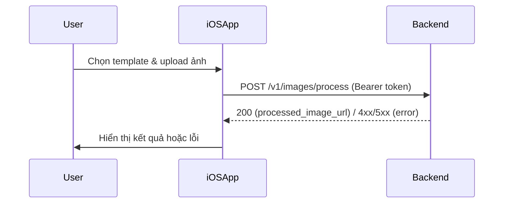

# Feature Implementation Plan: Image Processing API Integration (iOS SwiftUI)

## Status Checklist

- [ ] Xác nhận yêu cầu & flows từ tài liệu
- [ ] Liệt kê test scenarios backend & frontend
- [ ] Thiết kế model, viewmodel, service cho API call
- [ ] Viết test case cho ViewModel/service (TDD)
- [ ] Stub code, implement logic tối thiểu cho test pass
- [ ] Kết nối UI với ViewModel (EditorView, ResultView)
- [ ] Kiểm thử tích hợp end-to-end
- [ ] Cập nhật tài liệu & memory bank

---

## 1. Overview & Goals

Tích hợp endpoint `/v1/images/process` từ backend vào app iOS SwiftUI, cho phép người dùng đã đăng nhập chọn template, upload ảnh, gửi yêu cầu xử lý và nhận về ảnh kết quả đã được AI style hóa.

- **Tài liệu tham chiếu:**  
  - [.documents/api_specification.md](../.documents/api_specification.md)
  - [.documents/usecase_process_image.md](../.documents/usecase_process_image.md)
  - [.documents/usecase_auth.md](../.documents/usecase_auth.md)
  - [.documents/ui_ux_design.md](../.documents/ui_ux_design.md)
- **Mục tiêu:**  
  - Đảm bảo flow xác thực, chọn template, upload ảnh, xử lý ảnh, nhận kết quả, và hiển thị UI đúng như tài liệu.
  - Đảm bảo kiểm thử đầy đủ các trường hợp thành công, lỗi xác thực, lỗi dữ liệu, không tìm thấy, lỗi hệ thống.

---

## 2. Types/Structs/Classes

- **Models/Template.swift**: struct Template (id, name, thumbnail_url)
- **Models/ProcessImageRequest.swift**: struct ProcessImageRequest (template_id, image_path)
- **Models/ProcessImageResult.swift**: struct ProcessImageResult (processed_image_url)
- **ViewModels/ImageProcessingViewModel.swift**: class ImageProcessingViewModel
- **Utils/APIService.swift**: class APIService (gọi API backend)

---

## 3. Main Files & Functions

- Models/Template.swift
- Models/ProcessImageRequest.swift
- Models/ProcessImageResult.swift
- ViewModels/ImageProcessingViewModel.swift
- Views/ImageProcessingView.swift
- Views/ResultView.swift
- Utils/APIService.swift
- Tests: app_ios/imageaiwrapperTests/ImageProcessingViewModelTests.swift

---

## 4. Dependencies & Constraints

- **Firebase Auth:** Lấy ID token cho Authorization header.
- **Backend API:** Yêu cầu xác thực Bearer token (trừ khi DISABLE_AUTH=true khi dev local).
- **Swift Concurrency:** Sử dụng async/await cho API call.
- **Error Handling:** Hiển thị Alert khi lỗi, loading khi đang xử lý.
- **UI/UX:** Theo đúng wireframe và guideline trong .documents/ui_ux_design.md.

---

## 5. Test Scenarios

### Backend Integration

- [ ] Gửi request hợp lệ, nhận processed_image_url (200 OK)
- [ ] Gửi request thiếu trường, nhận 400 Bad Request
- [ ] Gửi token sai/hết hạn, nhận 401 Unauthorized
- [ ] Gửi template_id/image_path không tồn tại, nhận 404 Not Found
- [ ] Gặp lỗi backend, nhận 500 Internal Server Error

### Frontend/UI

- [ ] Chọn template, upload ảnh, nhấn "Generate", loading, nhận kết quả
- [ ] Nhận lỗi, hiển thị Alert, cho phép retry
- [ ] UI test: Đảm bảo các màn hình chuyển đúng flow, trạng thái nút, loading, error

---

## 6. Test Strategy

- **Unit Test:** ViewModel/service (mock API)
- **Integration Test:** End-to-end flow Editor → Result (mock hoặc real API)
- **UI Test:** Chuyển màn hình, trạng thái nút, loading, error

---

## 7. Mermaid Diagram

---

## 8. Implementation Order

1. Viết test case cho ViewModel/service (TDD)
2. Stub code, implement logic tối thiểu cho test pass
3. Kết nối UI với ViewModel (EditorView, ResultView)
4. Kiểm thử tích hợp end-to-end
5. Cập nhật tài liệu & memory bank

---

## 9. Notes

- Có thể tắt xác thực khi dev local bằng DISABLE_AUTH=true.
- Khi test UI, có thể mock API hoặc dùng endpoint thật.
- Cần cập nhật memory bank sau khi hoàn thành.
