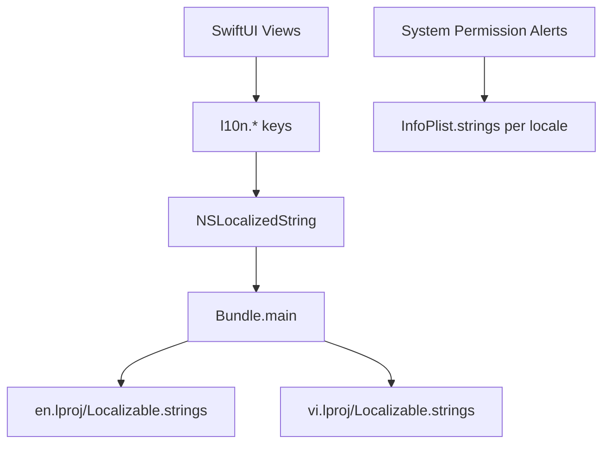

# iOS Localization (EN + VI) – Implementation Plan

Status: Planning and execution checklist

- [ ] Create localization resource folders and files
- [ ] Define initial key set (covering all found strings)
- [ ] Move permission strings to InfoPlist.strings
- [ ] Replace hardcoded strings in Swift files with [Swift.NSLocalizedString()](AIPhotoApp/AIPhotoApp/Views/ImageProcessing/TemplateSelectionView.swift:1)
- [ ] Verify in English and Vietnamese on simulator (App Language override)
- [ ] QA critical screens (Auth, Home, Search, Template Selection, Image Processing, Profile, Credits)
- [ ] Document follow-up tasks (in-app language switch, StoreKit localizations)

Scope

- Languages: English (Base, en), Vietnamese (vi)
- Screens covered now: Authentication, Home, Search, Template Selection, Image Processing, Profile, Credits
- Exclusions for this task: In-app language selector, StoreKit product localization (follow-up)

Folder and file layout

Create the following files:
- AIPhotoApp/AIPhotoApp/Resources/en.lproj/Localizable.strings
- AIPhotoApp/AIPhotoApp/Resources/vi.lproj/Localizable.strings
- AIPhotoApp/AIPhotoApp/Resources/en.lproj/InfoPlist.strings
- AIPhotoApp/AIPhotoApp/Resources/vi.lproj/InfoPlist.strings

Keys and mapping (initial inventory)

Replace the following hardcoded strings with keys. The mapping below references the source files for implementation:

- [AIPhotoApp/AIPhotoApp/Views/ImageProcessing/TemplateSelectionView.swift](AIPhotoApp/AIPhotoApp/Views/ImageProcessing/TemplateSelectionView.swift:1)
  - "Camera không khả dụng" → l10n.camera.unavailable
  - "Chọn ảnh" → l10n.image.select
  - "Chọn nguồn ảnh" → l10n.image.source
  - "Từ thư viện" → l10n.image.source.library
  - "Chụp ảnh" → l10n.image.source.camera
  - "Hủy" → l10n.common.cancel
  - "OK" → l10n.common.ok

- [AIPhotoApp/AIPhotoApp/Views/ImageProcessing/InsufficientCreditsView.swift](AIPhotoApp/AIPhotoApp/Views/ImageProcessing/InsufficientCreditsView.swift:1)
  - "Thành công" → l10n.common.success
  - "OK" → l10n.common.ok
  - "Không thể hiển thị quảng cáo." → l10n.ads.cannotPresent
  - "Mua Credits" → l10n.credits.buyTitle
  - "Mua gói credits với giá ưu đãi" → l10n.credits.buyDesc
  - "Mua ngay" → l10n.credits.buyNow

- [AIPhotoApp/AIPhotoApp/ViewModels/CreditsViewModel.swift](AIPhotoApp/AIPhotoApp/ViewModels/CreditsViewModel.swift:1)
  - "Quảng cáo chưa sẵn sàng. Vui lòng thử lại sau." → l10n.ads.notReady
  - "Không thể hiển thị quảng cáo: %@" → l10n.ads.cannotPresentWithError
  - "Lỗi khi xem quảng cáo: %@" → l10n.ads.watchError

- [AIPhotoApp/AIPhotoApp/Services/RewardedAdsService.swift](AIPhotoApp/AIPhotoApp/Services/RewardedAdsService.swift:1)
  - "Quảng cáo chưa sẵn sàng. Vui lòng thử lại sau." → l10n.ads.notReady
  - "Không thể hiển thị quảng cáo: %@" → l10n.ads.cannotPresentWithError

- [AIPhotoApp/AIPhotoApp/ViewModels/AuthViewModel.swift](AIPhotoApp/AIPhotoApp/ViewModels/AuthViewModel.swift:1)
  - "Không thể trình bày màn hình đăng nhập Google." → l10n.auth.googleCannotPresent
  - "Phiên đăng nhập không hợp lệ. Vui lòng thử lại." → l10n.auth.sessionInvalid
  - "Vui lòng nhập tên và email hợp lệ." → l10n.auth.invalidProfile

- [AIPhotoApp/AIPhotoApp/Views/Authentication/AuthLandingView.swift](AIPhotoApp/AIPhotoApp/Views/Authentication/AuthLandingView.swift:1)
  - "Đăng nhập thất bại. Vui lòng thử lại." → l10n.auth.signInFailed

- [AIPhotoApp/AIPhotoApp/Views/Authentication/ProfileCompletionView.swift](AIPhotoApp/AIPhotoApp/Views/Authentication/ProfileCompletionView.swift:1)
  - "Ảnh đại diện" → l10n.profile.avatar

- [AIPhotoApp/AIPhotoApp/Info.plist](AIPhotoApp/AIPhotoApp/Info.plist:243)
  - NSCameraUsageDescription: "Ứng dụng cần dùng camera để chụp ảnh xử lý AI"
    → Move to InfoPlist.strings key "NSCameraUsageDescription"

Localizable.strings content (initial)

en.lproj/Localizable.strings

l10n.camera.unavailable = "Camera not available";
l10n.image.select = "Select Photo";
l10n.image.source = "Choose Photo Source";
l10n.image.source.library = "From Library";
l10n.image.source.camera = "Take Photo";
l10n.common.cancel = "Cancel";
l10n.common.ok = "OK";
l10n.common.success = "Success";
l10n.ads.cannotPresent = "Unable to present ad.";
l10n.credits.buyTitle = "Buy Credits";
l10n.credits.buyDesc = "Buy credit packages at a great price";
l10n.credits.buyNow = "Buy Now";
l10n.ads.notReady = "Ad is not ready. Please try again later.";
l10n.ads.cannotPresentWithError = "Unable to present ad: %@";
l10n.ads.watchError = "Error while watching ad: %@";
l10n.auth.googleCannotPresent = "Cannot present Google sign-in screen.";
l10n.auth.sessionInvalid = "Invalid session. Please try again.";
l10n.auth.invalidProfile = "Please enter a valid name and email.";
l10n.auth.signInFailed = "Sign in failed. Please try again.";
l10n.profile.avatar = "Avatar";

vi.lproj/Localizable.strings

l10n.camera.unavailable = "Camera không khả dụng";
l10n.image.select = "Chọn ảnh";
l10n.image.source = "Chọn nguồn ảnh";
l10n.image.source.library = "Từ thư viện";
l10n.image.source.camera = "Chụp ảnh";
l10n.common.cancel = "Hủy";
l10n.common.ok = "OK";
l10n.common.success = "Thành công";
l10n.ads.cannotPresent = "Không thể hiển thị quảng cáo.";
l10n.credits.buyTitle = "Mua Credits";
l10n.credits.buyDesc = "Mua gói credits với giá ưu đãi";
l10n.credits.buyNow = "Mua ngay";
l10n.ads.notReady = "Quảng cáo chưa sẵn sàng. Vui lòng thử lại sau.";
l10n.ads.cannotPresentWithError = "Không thể hiển thị quảng cáo: %@";
l10n.ads.watchError = "Lỗi khi xem quảng cáo: %@";
l10n.auth.googleCannotPresent = "Không thể trình bày màn hình đăng nhập Google.";
l10n.auth.sessionInvalid = "Phiên đăng nhập không hợp lệ. Vui lòng thử lại.";
l10n.auth.invalidProfile = "Vui lòng nhập tên và email hợp lệ.";
l10n.auth.signInFailed = "Đăng nhập thất bại. Vui lòng thử lại.";
l10n.profile.avatar = "Ảnh đại diện";

InfoPlist.strings content

en.lproj/InfoPlist.strings

NSCameraUsageDescription = "The app needs camera access to capture photos for AI processing";

vi.lproj/InfoPlist.strings

NSCameraUsageDescription = "Ứng dụng cần dùng camera để chụp ảnh xử lý AI";

Implementation steps

1) Resources: Create folders and files listed above.
2) Info.plist: Remove inline camera usage description string and rely on InfoPlist.strings.
3) Code changes: For each mapping item, replace hardcoded string with [Swift.NSLocalizedString()](AIPhotoApp/AIPhotoApp/Views/ImageProcessing/TemplateSelectionView.swift:1), e.g.:
   - Text(NSLocalizedString("l10n.image.select", comment: "Select photo button"))
   - alert(Text(NSLocalizedString("l10n.camera.unavailable", comment: "")), ...)
   - Button(NSLocalizedString("l10n.common.cancel", comment: ""), role: .cancel) { }
4) Formatting with arguments: use String(format:) for placeholders like "%@", or [Swift.String.localizedStringWithFormat()](AIPhotoApp/AIPhotoApp/Views/ImageProcessing/InsufficientCreditsView.swift:1).
5) Xcode project: Add Vietnamese to Project → Info → Localizations (English, Vietnamese). Ensure the new .strings files are part of the app target.
6) Accessibility: Also localize [.accessibilityLabel](AIPhotoApp/AIPhotoApp/Views/Authentication/ProfileCompletionView.swift:50) values (e.g., l10n.profile.avatar).

Testing plan

- In Xcode, edit the scheme → Options → Application Language: English, then Vietnamese. Verify all screens.
- Set iOS Simulator language and region to Vietnamese and English, verify strings switch accordingly.
- Pay special attention to alerts, confirmation dialogs, and accessibility labels.

Acceptance criteria

- All listed strings are localized and visible in both EN and VI with no truncation.
- Permission prompt shows localized text via InfoPlist.strings.
- No hardcoded Vietnamese remains in the covered files.
- Build succeeds without warnings; runtime shows correct language based on system setting.

Out-of-scope follow-up tasks (to create separate plan)

- In-app language switch in Settings/Profile with runtime bundle override.
- StoreKit product name/description localization in [AIPhotoApp/AIPhotoApp/BokPhoto.storekit](AIPhotoApp/AIPhotoApp/BokPhoto.storekit:1).
- Broader audit for any remaining user-facing strings across the app.

Architecture note

We will keep localization usage simple and native (no custom wrappers yet). If key volume grows, consider adding a thin L10n enum wrapper file later for type-safe access. All usages remain compatible with [Swift.NSLocalizedString()](AIPhotoApp/AIPhotoApp/Views/Home/HomeView.swift:1).

Mermaid – i18n resource resolution

Owners and timeline

- Implementation: 0.5 day (strings + InfoPlist + replacements)
- QA: 0.5 day across EN/VI

Notes

- Use descriptive comments in NSLocalizedString to aid translators.
- Keep keys stable; avoid embedding punctuation in keys.
- Reuse common keys like l10n.common.ok, l10n.common.cancel across app.