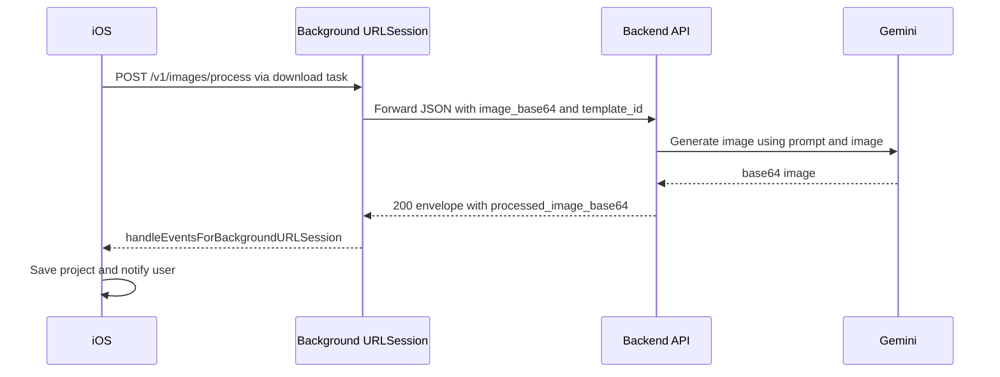

# Implementation Plan: Gemini Image Processing Phase 1
Long HTTP on backend + Background URLSession on iOS, with strict TDD

Owner: Backend + iOS
Status: Planning created for execution

References
- Feature spec: [.documents/features/gemini-image-processing.md](.documents/features/gemini-image-processing.md)
- NestJS integration guide: [.documents/integrations/gemini-api-nestjs.md](.documents/integrations/gemini-api-nestjs.md)
- iOS background guide: [.documents/platform-guides/ios-background-processing.md](.documents/platform-guides/ios-background-processing.md)
- Current backend code:
  - [server/src/images/images.controller.ts](server/src/images/images.controller.ts)
  - [server/src/images/images.service.ts](server/src/images/images.service.ts)
  - [server/src/gemini/gemini.service.ts](server/src/gemini/gemini.service.ts)
- Current iOS code:
  - [AIPhotoApp/AIPhotoApp/Utilities/BackgroundImageProcessor.swift](AIPhotoApp/AIPhotoApp/Utilities/BackgroundImageProcessor.swift)
  - [AIPhotoApp/AIPhotoApp/ViewModels/ImageProcessingViewModel.swift](AIPhotoApp/AIPhotoApp/ViewModels/ImageProcessingViewModel.swift)
  - [AIPhotoApp/AIPhotoApp/Models/DTOs/ProcessImageDTOs.swift](AIPhotoApp/AIPhotoApp/Models/DTOs/ProcessImageDTOs.swift)
  - [AIPhotoApp/AIPhotoApp/App/AIPhotoAppApp+Background.swift](AIPhotoApp/AIPhotoApp/App/AIPhotoAppApp+Background.swift)

Mermaid overview

Scope and goals
- Deliver Phase 1 path using Long HTTP on backend and Background URLSession on iOS
- No server-side job queue or persistence for images; iOS owns storage
- Credits enforcement end to end
- Strong test coverage on both platforms

Out of scope
- Async job queue and polling
- Push notifications from server
- Multi-image and video processing
- Cloud history sync

Acceptance criteria
- Backend: POST /v1/images/process returns envelope success with processed_image_base64 in < 60s under normal load, enforces 1 credit, returns structured errors for validation, content policy, insufficient credits, and timeout
- iOS: Background processing succeeds when app is backgrounded or killed; completion triggers local notification; result saved to Projects; insufficient credits error is surfaced and navigates to purchase
- Tests: All new unit and E2E tests pass in CI with deterministic behavior

Status checklist
- [ ] Backend config verified for Gemini and mock mode
- [ ] Backend unit tests for GeminiService
- [ ] Backend unit tests for ImagesService including credits and mock path
- [ ] Backend E2E tests for /v1/images/process happy and error paths
- [ ] Swagger updated for images endpoint and errors
- [ ] iOS unit tests for ImageProcessingViewModel states
- [ ] iOS functional tests for BackgroundImageProcessor decoding and notifications
- [ ] iOS storage tests for ProjectsStorageManager save deduplication on requestId
- [ ] App delegate background handler verified
- [ ] Manual runbook and rollout

Architecture alignment
- Backend is already implemented for Phase 1 core flow:
  - Images controller wires request to service [server/src/images/images.controller.ts](server/src/images/images.controller.ts)
  - Images service validates, calls Gemini, enforces credits, returns response [server/src/images/images.service.ts](server/src/images/images.service.ts)
  - Gemini service uses Google SDK, parses candidates [server/src/gemini/gemini.service.ts](server/src/gemini/gemini.service.ts)
  - Mock mode via USE_MOCK_IMAGE is implemented and cost-saving path exists
- iOS is already implemented for Background URLSession:
  - BackgroundImageProcessor with downloadTask pipeline and notifications [AIPhotoApp/AIPhotoApp/Utilities/BackgroundImageProcessor.swift](AIPhotoApp/AIPhotoApp/Utilities/BackgroundImageProcessor.swift)
  - ImageProcessingViewModel integrates background pipeline and states [AIPhotoApp/AIPhotoApp/ViewModels/ImageProcessingViewModel.swift](AIPhotoApp/AIPhotoApp/ViewModels/ImageProcessingViewModel.swift)
  - DTOs for process request and response [AIPhotoApp/AIPhotoApp/Models/DTOs/ProcessImageDTOs.swift](AIPhotoApp/AIPhotoApp/Models/DTOs/ProcessImageDTOs.swift)
- Phase 1 focus is completing TDD coverage, hardening error mapping, and ensuring docs and swagger match behavior

Backend plan and TDD

1) Configuration and environment
- Verify env keys exist with sensible defaults
  - .env example includes GEMINI_API_KEY, GEMINI_MODEL, GEMINI_TIMEOUT_MS, USE_MOCK_IMAGE
- Ensure gemini.config is registered and read by ConfigModule
- Action: add configuration unit test to assert defaults load

2) DTO validation and mapping
- Confirm ProcessImageDto validates:
  - template_id required and UUID format
  - image_base64 present and size <= 10MB validated at service
  - options.width and height multiples of 64 if provided; cap 512-2048
- Add unit tests to assert BadRequest on invalid payloads

3) GeminiService tests
- Happy path returns parsed inlineData from candidates
- Timeout path surfaces 504
- Content policy path surfaces 422 inappropriate_content
- Quota exceeded maps to 429 with gemini_api_error code
- No image parts maps to 502 gemini_api_error
- Files: place tests under server/src/gemini/gemini.service.spec.ts as referenced in docs [server/src/gemini/gemini.service.ts](server/src/gemini/gemini.service.ts)

4) ImagesService tests
- Validates base64 and rejects oversized
- NotFound when template does not exist
- Enforces credit availability: returns 403 insufficient_credits without calling Gemini
- Deducts 1 credit only after success (spy CreditsService)
- Propagates Gemini error codes to envelope
- Mock mode path returns mock base64 and deducts 1 credit
- Files: server/src/images/images.service.spec.ts targeting [server/src/images/images.service.ts](server/src/images/images.service.ts)

5) E2E tests for images endpoint
- 200 with valid token, template, and base64
- 401 with invalid token
- 404 with invalid template_id
- 413 for oversized image
- 403 insufficient_credits when balance is zero
- 422 inappropriate_content mapping
- 504 simulated timeout mapping
- Implement in [server/test/images.e2e-spec.ts](server/test/images.e2e-spec.ts) with existing e2e config

6) Swagger and docs
- Ensure swagger/openapi.yaml documents request body schema, envelope response, and error examples
- Add error codes table aligned with feature spec
- Link to swagger in README

iOS plan and TDD

1) Background session lifecycle verification
- Ensure handleEventsForBackgroundURLSession lives in app delegate file [AIPhotoApp/AIPhotoApp/App/AIPhotoAppApp+Background.swift](AIPhotoApp/AIPhotoApp/App/AIPhotoAppApp+Background.swift)
- Verify BackgroundImageProcessor.session identifier matches the delegate handler
- Test: Simulate completion notification and assert the completion handler is called exactly once

2) ImageProcessingViewModel tests
- Initial state equals idle
- processImage transitions: preparing → uploading → processing
- On .imageProcessingCompleted notification with matching requestId, state becomes completed and progress becomes 1.0
- On .imageProcessingFailed with insufficientCredits, state becomes failed and error matches user-facing message
- On startup with pending tasks in defaults, state becomes processingInBackground
- File: [AIPhotoApp/AIPhotoAppTests/ImageProcessingViewModelTests.swift](AIPhotoApp/AIPhotoAppTests/ImageProcessingViewModelTests.swift)

3) BackgroundImageProcessor decoding and storage tests
- Given a valid JSON envelope file with processed_image_base64, decode, strip prefix, base64 decode, and save project through ProjectsStorageManager
- Duplicate requestId is deduped by ProjectsStorageManager
- HTTP error 403 with error.code=insufficient_credits posts .imageProcessingFailed with ProcessingError.insufficientCredits
- Clean up pending task and temp files after completion
- File: add [AIPhotoApp/AIPhotoAppTests/BackgroundImageProcessorTests.swift](AIPhotoApp/AIPhotoAppTests/BackgroundImageProcessorTests.swift) exercising delegate methods via a test double URLSession

4) Projects storage tests
- Save and reload projects from disk
- Ensure newest by templateId logic used when notifying completion
- File exists: [AIPhotoApp/AIPhotoAppTests/ProjectsStorageManagerTests.swift](AIPhotoApp/AIPhotoAppTests/ProjectsStorageManagerTests.swift)

5) Notifications
- NotificationManager shows local notification when applicationState is not active
- Register category IMAGE_COMPLETE with action VIEW_IMAGE on startup
- Tests should stub UNUserNotificationCenter and assert add was invoked

6) Credits flow integration
- When ProcessingError.insufficientCredits is posted, ImageProcessingView should route to InsufficientCreditsView with purchase action
- UI snapshot test optional; minimal unit test asserts state transitions

Execution steps and commands

Backend
- Build, lint, test
  - Build: run in server per AGENTS.md
    - yarn build
  - Unit tests:
    - yarn test
  - E2E tests:
    - yarn test:e2e
  - Coverage:
    - yarn test:cov

iOS
- Build and run tests
  - xcodebuild test -scheme AIPhotoApp -destination 'platform=iOS Simulator,name=iPhone 17' -only-testing:AIPhotoAppTests -parallel-testing-enabled NO | xcpretty --color --test
- Ensure tests do not rely on network; mock responses and use local fixtures

Detailed task list with TDD ordering

Backend
- [ ] Write failing unit tests for GeminiService covering success, timeout, safety, quota, malformed responses
- [ ] Implement or adjust GeminiService to satisfy tests where needed (parsing, error mapping)
- [ ] Write failing unit tests for ImagesService for validation, template not found, credits check, mock mode, success path, deduction after success
- [ ] Adjust ImagesService to ensure only post-success credit deduction and consistent logging
- [ ] Write failing E2E tests for /v1/images/process for 200, 401, 404, 413, 403, 422, 504
- [ ] Ensure BearerAuthGuard and envelope mapping produce expected responses; align status codes
- [ ] Update swagger/openapi.yaml with request and response examples and error schemas
- [ ] Add seed or helper to ensure test template and user credits for E2E

iOS
- [ ] Add BackgroundImageProcessorTests to simulate URLSessionDownloadDelegate success and error paths using test doubles
- [ ] Expand ImageProcessingViewModelTests for state progression and notifications handling
- [ ] Verify ProjectsStorageManager deduplication by requestId in tests
- [ ] Add NotificationManager test to assert UNNotificationRequest scheduling
- [ ] Verify AppDelegate background completion handler path in a small integration test
- [ ] Wire InsufficientCreditsView navigation on ProcessingError.insufficientCredits and add unit test on ViewModel signaling

Risk and mitigations
- Large base64 payloads: ensure 60s HTTP timeout server side and 300s resource timeout on iOS background session; enforce 10MB cap in validation
- Content policy errors: mapped to 422 in backend; iOS presents friendly message and no project save
- Insufficient credits: backend returns 403 with code insufficient_credits; iOS routes to purchase screen
- Simulator networking: ensure AppConfig.baseURL uses Mac IP per SIMULATOR_NETWORK_FIX; tests must not depend on real API
- Gemini quota: protect E2E by using USE_MOCK_IMAGE=true locally and skip real calls in CI

Rollout plan
- Enable USE_MOCK_IMAGE=true in dev environment for safe local iteration
- Complete tests and ensure CI pass
- Turn off mock mode in staging and validate with limited real calls
- Monitor logs for generation_time_ms and error codes
- Ship with feature flag in iOS if needed for staged rollout

Appendix: API contract snapshot
- Endpoint: POST /v1/images/process
- Auth: Firebase Bearer token
- Request: JSON with template_id, image_base64 with data URI, options width height quality
- Response success envelope: processed_image_base64 with data URI, metadata including model_used and processed_dimensions
- Error envelope codes: unauthorized, invalid_template, invalid_image_format, image_too_large, invalid_dimensions, rate_limit_exceeded, gemini_api_error, processing_timeout, inappropriate_content, insufficient_credits

Files to touch
- Backend tests:
  - [server/src/gemini/gemini.service.spec.ts](server/src/gemini/gemini.service.spec.ts)
  - [server/src/images/images.service.spec.ts](server/src/images/images.service.spec.ts)
  - [server/test/images.e2e-spec.ts](server/test/images.e2e-spec.ts)
  - [swagger/openapi.yaml](swagger/openapi.yaml)
- iOS tests:
  - [AIPhotoApp/AIPhotoAppTests/ImageProcessingViewModelTests.swift](AIPhotoApp/AIPhotoAppTests/ImageProcessingViewModelTests.swift)
  - New: [AIPhotoApp/AIPhotoAppTests/BackgroundImageProcessorTests.swift](AIPhotoApp/AIPhotoAppTests/BackgroundImageProcessorTests.swift)
  - [AIPhotoApp/AIPhotoAppTests/ProjectsStorageManagerTests.swift](AIPhotoApp/AIPhotoAppTests/ProjectsStorageManagerTests.swift)
  - New: AIPhotoApp notification test file for NotificationManager

Runbook notes
- For local iOS manual runs, ensure notification permissions granted and background modes enabled for background fetch and remote notifications if needed
- For E2E backend local runs, start Postgres via docker-compose, run server with DEV_AUTH for admin-only tests where applicable
