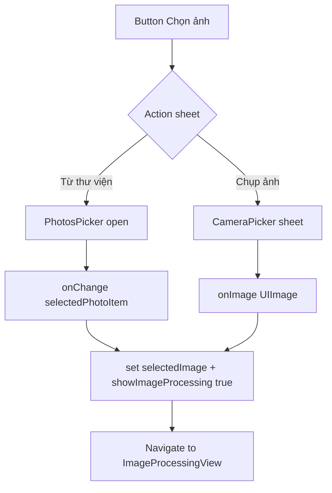

# TemplateSelectionView: Add Camera via Action Sheet

Status
- [ ] Review and approve plan
- [ ] Add CameraPicker wrapper
- [ ] Add NSCameraUsageDescription to Info.plist
- [ ] Integrate confirmationDialog in TemplateSelectionView
- [ ] Add photosPicker modifier path
- [ ] Add sheet for camera
- [ ] Implement camera availability fallback
- [ ] Build and test on device
- [ ] Update memory bank context if needed

Summary
Goal: Allow user to choose between library or camera from a single action sheet, while preserving current flow that navigates to ImageProcessingView after image is obtained.

Current state analysis
- Library selection exists via [Swift.PhotosPicker()](AIPhotoApp/AIPhotoApp/Views/ImageProcessing/TemplateSelectionView.swift:205) with robust loading in [Swift.onChange(of:selectedPhotoItem)](AIPhotoApp/AIPhotoApp/Views/ImageProcessing/TemplateSelectionView.swift:50).
- Navigation to processing exists via [Swift.navigationDestination(isPresented: $showImageProcessing)](AIPhotoApp/AIPhotoApp/Views/ImageProcessing/TemplateSelectionView.swift:83).
- No camera integration; no camera wrapper; no action sheet.

Design constraints and UX
- Keep MVVM boundaries: no business logic in View beyond routing and UI state.
- Maintain Liquid Glass visuals for the main pick area.
- Support device only for camera; simulator will not have camera.
- Strings in Vietnamese.

Proposed solution overview
- Replace direct PhotosPicker button with a single glass card button Chọn ảnh that opens an action sheet using confirmationDialog.
- On action sheet:
  - Từ thư viện → triggers PhotosPicker via a view modifier bound to showLibraryPicker.
  - Chụp ảnh → presents a CameraPicker wrapper via sheet and returns a UIImage.
- Reuse existing selectedImage and showImageProcessing to keep the navigation flow unchanged.

Changes by file
1) New file: AIPhotoApp/AIPhotoApp/Utilities/Camera/CameraPicker.swift
   - Create a lightweight UIKit wrapper to access the camera and return a UIImage.
   - API shape:
     - [Swift.struct CameraPicker()](AIPhotoApp/AIPhotoApp/Utilities/Camera/CameraPicker.swift): UIViewControllerRepresentable
     - init(onImage: @escaping (UIImage) -> Void, onCancel: @escaping () -> Void = {})
     - Uses UIImagePickerController with sourceType .camera, allows cancel, returns original photo

2) Update Info.plist
   - Add NSCameraUsageDescription with a user-friendly reason, e.g. Ứng dụng cần dùng camera để chụp ảnh xử lý AI.

3) Update TemplateSelectionView.swift
   - Add UI state:
     - @State private var showSourceDialog: Bool = false
     - @State private var showLibraryPicker: Bool = false
     - @State private var showCamera: Bool = false
     - @State private var showCameraUnavailableAlert: Bool = false
   - Replace the current PhotosPicker card with a Button Chọn ảnh that sets showSourceDialog = true.
   - Add a confirmationDialog(bound to showSourceDialog) with options:
     - Từ thư viện → set showLibraryPicker = true
     - Chụp ảnh → if UIImagePickerController.isSourceTypeAvailable(.camera) set showCamera = true else set showCameraUnavailableAlert = true
   - Add the PhotosPicker view modifier at the container level:
     - .photosPicker(isPresented: $showLibraryPicker, selection: $selectedPhotoItem, matching: .images)
   - Add a sheet for camera:
     - .sheet(isPresented: $showCamera) { CameraPicker { image in selectedImage = image; showImageProcessing = true } onCancel: { } }
   - Keep existing .onChange(of: selectedPhotoItem) loader and .navigationDestination.

Edge cases
- Camera unavailable: show an alert explaining that camera is not available on this device.
- User cancels picker or camera: simply close UI; do not mutate selectedImage.
- iCloud photos not fully downloaded: current load fallback already handles URL and Data, keep as is.

Acceptance criteria
- Tapping Chọn ảnh shows an action sheet with Từ thư viện and Chụp ảnh.
- Choosing Từ thư viện opens the standard photo library and selecting a photo navigates to ImageProcessingView.
- Choosing Chụp ảnh opens the camera, capturing a photo navigates to ImageProcessingView.
- Cancelling either flow keeps the user on TemplateSelectionView with no state changes besides UI flags.
- If camera not available, an alert appears and no crash occurs.

Testing plan
- Device test: Verify camera flow on a real iPhone.
- Simulator test: Verify library flow; choose Chụp ảnh shows not available alert.
- Regression: Ensure PhotosPicker based flow still loads image and navigates correctly.

Implementation notes and sample signatures
- Camera wrapper type signature:
  - [Swift.struct CameraPicker()](AIPhotoApp/AIPhotoApp/Utilities/Camera/CameraPicker.swift)
- TemplateSelectionView additions:
  - Confirmation dialog attached near root VStack or ZStack
  - PhotosPicker modifier attached to top-level container
  - Sheet for camera at the same level as other modifiers

Mermaid flow

Rollback
- Revert to the previous PhotosPicker button UI and remove the new states and modifiers.

Estimated effort
- 1 hour for implementation
- 30 minutes for on-device testing and polish

Ready for implementation
- If approved, proceed to Code mode to add the new file and modify TemplateSelectionView.swift as described.