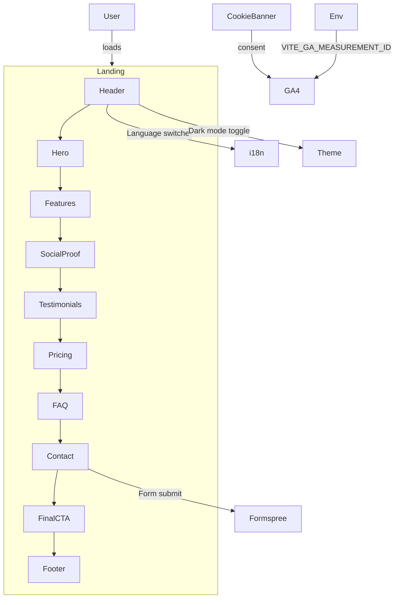

# AI Photo Studio — Landing Page Implementation Plan

Status: Pending approval
Owner: Frontend
Last updated: 2025-11-13

1. Summary and Objectives
- Brand: AI Photo Studio
- Tagline: Create. Style. Share.
- Core value: Hundreds of photo styles from cinematic to anime, optimized for social media, fast and privacy-first.
- Audience: Social media users who love cinematic/anime styles (mobile-first, VN/SEA).
- Primary conversions: Download iOS app, purchase starter credits.
- Success criteria: Lighthouse > 90 on Performance, Accessibility, Best Practices, SEO. Accessible UI (WCAG AA). Fast TTI/TBT.

2. Tech Stack and Conventions
- Build tool: Vite (React)
- Package manager: Yarn
- UI: Tailwind CSS (darkMode 'class'), Framer Motion for subtle animations
- Fonts: Sora (heading), Inter (body) via Google Fonts
- Lint/format: ESLint + Prettier + prettier-plugin-tailwindcss
- Tests: Vitest + React Testing Library
- i18n: react-i18next (en default, vi secondary) with header language switcher
- Analytics: GA4 via gtag only when env present and after cookie consent
- Forms: Formspree, with client-side validation and reCAPTCHA v3
- Code quality: Strict ESLint rules for React 19, hooks, accessibility
- Image strategy: Unsplash public images with specific URLs, lazy loading, decoding="async", fetchpriority on hero

3. Theme and Design Tokens
- Preset A — Liquid Glass Beige
  - Primary Text: #4A3F35
  - Base (bg): #F5E6D3
  - Surface: #F4E4C1
  - Accent: #E8D5D0
  - Emphasis (highlight): #7C3AED
- Fonts: Sora (headings), Inter (body)
- Tailwind
  - darkMode: 'class'
  - container: centered with responsive padding
  - breakpoints: md 768, lg 1024, xl 1280, 2xl 1536
  - custom palette for brand colors and semantic roles (brand, bg, surface, accent, emphasis)

4. Information Architecture and Sections
Order:
1) Header (sticky) with logo, nav, CTA, language switcher, dark mode toggle
2) Hero (headline, subheadline, primary CTA “Download iOS”, secondary CTA “Start with 2 free credits”, hero image before/after)
3) Features/Benefits (3–6 items, grid)
4) Social Proof (partner logos)
5) Testimonials (2–3 cards)
6) Pricing (Starter $5, Pro $12, Studio $25; Monthly default; Yearly: -20% paid upfront; USD)
7) FAQ (accordion)
8) Contact/Lead Form (Formspree + reCAPTCHA; success/failure messages)
9) Final CTA (re-iterate primary CTA)
10) Footer (legal, privacy, terms, language switcher duplication if needed)

Copy tone: Cinematic minimalist, consistent with iOS beige aesthetic.

5. Content Decisions and Assets
- Hero copy (en default; vi provided in i18n):
  - Headline (vi): Ảnh cinematic trong 1 chạm
  - Subheadline (vi): Hàng trăm phong cách từ điện ảnh đến anime, tối ưu cho mạng xã hội, tải nhanh và riêng tư.
  - Primary CTA: Download on iOS
  - Secondary CTA: Start with 2 free credits
- Hero imagery (before/after cinematic portrait), Unsplash examples:
  - Before (portrait): https://images.unsplash.com/photo-1494790108377-be9c29b29330?auto=format&fit=crop&w=1600&q=80
  - After (cinematic feel): https://images.unsplash.com/photo-1519400197429-404ae1a1e184?auto=format&fit=crop&w=1600&q=80
- Social proof example logos (public brand assets, can be replaced later):
  - Vercel: https://assets.vercel.com/image/upload/v1662130559/front/nextjs/twitter-card.png
  - Unsplash: https://assets.unsplash.com/logo-black.svg (fallback if blocked: https://upload.wikimedia.org/wikipedia/commons/3/32/Unsplash_logo.svg)
  - Netlify: https://www.netlify.com/v3/img/components/logomark.png
  - GitHub: https://github.githubassets.com/images/modules/logos_page/GitHub-Mark.png
- Testimonials: 2–3 sample cards with avatar (Unsplash), name, role, quote
- App Store link: https://apps.apple.com/app/idXXXXXXXXX (placeholder now; button links here)
- OG Image: Use hero image (1200x630) initially from Unsplash; replace with hosted static later

6. SEO and Index HTML
- Title (en): AI Photo Studio — Cinematic photos in one tap
- Title (vi): AI Photo Studio — Ảnh cinematic trong 1 chạm
- Meta description (en): Turn portraits into cinematic or anime styles in seconds. Fast, private, social-ready.
- Meta description (vi): Biến ảnh chân dung thành phong cách điện ảnh hoặc anime trong vài giây. Nhanh, riêng tư, sẵn sàng mạng xã hội.
- Canonical: https://aiphoto.studio
- Meta tags: viewport, theme-color (#F5E6D3 light, #0b0e0f dark), robots, language
- Open Graph: og:title, og:description, og:image (1200x630), og:url, og:type=website
- Twitter Card: summary_large_image, site handle if provided
- Web manifest: name, short_name, icons (maskable), theme_color, background_color
- Favicon set: 16x16, 32x32, apple-touch-icon

7. Accessibility and A11y Strategy
- Semantic HTML5 sections and headings hierarchy
- aria-labels for interactive controls, descriptive alt text
- Keyboard: tab order, focus styles (focus-visible), skip to content
- Color contrast: ensure text vs background meets WCAG AA
- Language attribute and i18n toggling updates lang on html
- Reduced motion respect via prefers-reduced-motion media query

8. Performance Plan
- Preconnect to fonts.gstatic.com; load fonts with display=swap
- Use responsive image attributes (sizes) and lazy loading
- Split code: lazy import sections (Testimonials, FAQ)
- Tree-shake and minify via Vite defaults
- Avoid blocking scripts; defer GA and load only after consent
- Inline critical meta and canonical; minimal 3rd-party

9. Privacy and Analytics
- GA4: only load when VITE_GA_MEASUREMENT_ID is set and user consented via cookie banner
- Cookie banner: minimal, accessible, stores consent in localStorage with 365-day TTL
- No PII tracked; form submissions through Formspree with reCAPTCHA token

10. Internationalization (react-i18next)
- Default language: en
- Secondary: vi
- Language switcher in Header; persist in localStorage; also reflect in html lang
- Namespaces: common, hero, features, pricing, faq, form, footer

11. Environment Variables (.env)
- VITE_GA_MEASUREMENT_ID=G-AB12CD34EF
- VITE_FORMSPREE_ENDPOINT=https://formspree.io/f/xxxxxxxx
- VITE_RECAPTCHA_SITE_KEY=your_site_key
- VITE_DEFAULT_LOCALE=en
- VITE_CANONICAL_URL=https://aiphoto.studio

12. Files and Structure
App root (to be created):
- [package.json](landing-page/package.json)
- [vite.config.js](landing-page/vite.config.js)
- [index.html](landing-page/index.html)
- [tailwind.config.js](landing-page/tailwind.config.js)
- [postcss.config.js](landing-page/postcss.config.js)
- [.eslintrc.json](landing-page/.eslintrc.json)
- [.prettierrc.json](landing-page/.prettierrc.json)
- [.prettierignore](landing-page/.prettierignore)
- [.gitignore](landing-page/.gitignore)
- [public/site.webmanifest](landing-page/public/site.webmanifest)
- [public/favicon-32x32.png](landing-page/public/favicon-32x32.png) (add actual file later)
- [public/favicon-16x16.png](landing-page/public/favicon-16x16.png) (add actual file later)
- [src/main.jsx](landing-page/src/main.jsx)
- [src/App.jsx](landing-page/src/App.jsx)
- [src/i18n/index.js](landing-page/src/i18n/index.js)
- [src/i18n/locales/en/common.json](landing-page/src/i18n/locales/en/common.json)
- [src/i18n/locales/vi/common.json](landing-page/src/i18n/locales/vi/common.json)
- [src/styles/tailwind.css](landing-page/src/styles/tailwind.css)
- [src/hooks/useDarkMode.js](landing-page/src/hooks/useDarkMode.js)
- [src/hooks/useCookieConsent.js](landing-page/src/hooks/useCookieConsent.js)
- [src/components/Header.jsx](landing-page/src/components/Header.jsx)
- [src/components/Footer.jsx](landing-page/src/components/Footer.jsx)
- [src/components/LanguageSwitcher.jsx](landing-page/src/components/LanguageSwitcher.jsx)
- [src/components/ThemeToggle.jsx](landing-page/src/components/ThemeToggle.jsx)
- [src/components/CookieBanner.jsx](landing-page/src/components/CookieBanner.jsx)
- [src/sections/Hero.jsx](landing-page/src/sections/Hero.jsx)
- [src/sections/Features.jsx](landing-page/src/sections/Features.jsx)
- [src/sections/SocialProof.jsx](landing-page/src/sections/SocialProof.jsx)
- [src/sections/Testimonials.jsx](landing-page/src/sections/Testimonials.jsx)
- [src/sections/Pricing.jsx](landing-page/src/sections/Pricing.jsx)
- [src/sections/FAQ.jsx](landing-page/src/sections/FAQ.jsx)
- [src/sections/Contact.jsx](landing-page/src/sections/Contact.jsx)
- [src/sections/FinalCTA.jsx](landing-page/src/sections/FinalCTA.jsx)
- [src/utils/gtag.js](landing-page/src/utils/gtag.js)
- [src/utils/recaptcha.js](landing-page/src/utils/recaptcha.js)
- [tests/Header.test.jsx](landing-page/tests/Header.test.jsx)
- [tests/Form.test.jsx](landing-page/tests/Form.test.jsx)

13. Detailed TODO Checklist
A) Initialize project
- [] Create Vite + React project with Yarn
- [] Add Tailwind, PostCSS, config darkMode 'class'
- [] Add ESLint, Prettier, prettier-plugin-tailwindcss
- [] Add Vitest and React Testing Library config
- [] Add Framer Motion, react-i18next

B) Theming and global
- [] Configure Tailwind with brand palette and container settings
- [] Add Google Fonts (Sora, Inter) with preconnect
- [] Implement dark mode toggle respecting prefers-color-scheme and persist to localStorage
- [] Implement cookie consent banner

C) i18n
- [] Setup react-i18next with en (default) and vi
- [] Add language switcher and persist selection
- [] Provide translations for common UI, hero, features, pricing, faq, form, footer

D) Layout and components
- [] Header (sticky): logo, nav, CTA, language switcher, theme toggle, mobile menu (accessible)
- [] Footer: legal links and secondary nav
- [] CookieBanner (deferred GA load after consent)

E) Sections
- [] Hero: headline/subheadline, two CTAs, hero image with before/after
- [] Features: grid with icons and subtle motion
- [] Social Proof: partner logos row
- [] Testimonials: 2–3 cards (lazy-loaded section)
- [] Pricing: monthly/yearly toggle, USD, -20% yearly
- [] FAQ: accessible accordion
- [] Contact Form: Formspree + reCAPTCHA v3, client validation, success/error states
- [] Final CTA: reiterate primary action

F) Analytics and SEO
- [] Load GA gtag only if env present and consented
- [] SEO meta (title/desc per locale), canonical, OG/Twitter, manifest, favicons
- [] Set html lang and direction dynamically based on i18n

G) Performance and accessibility
- [] Lazy-load non-critical sections (Testimonials, FAQ)
- [] Use loading="lazy" and decoding attr for images
- [] Focus-visible rings and proper aria labels
- [] Lighthouse pass > 90 across all categories

H) Tests
- [] Header mobile menu toggles with keyboard and click
- [] Contact form validation and success/failure flows mocked

I) Deployment
- [] Vercel-ready: build command, output, environment variables
- [] Domain mapping aiphoto.studio and canonical
- [] Document env variables and color update instructions

14. Mermaid — High-level Flow

15. Yarn Scripts (to be added)
- dev: vite
- build: vite build
- preview: vite preview
- lint: eslint src --ext .js,.jsx
- format: prettier --write .
- test: vitest run
- test:ui: vitest
- typecheck: (optional if TS introduced later)

16. Deployment Notes (Vercel)
- Create project in Vercel, connect repo
- Framework: Vite
- Build: yarn build
- Output: dist
- Env: VITE_GA_MEASUREMENT_ID, VITE_FORMSPREE_ENDPOINT, VITE_RECAPTCHA_SITE_KEY, VITE_DEFAULT_LOCALE, VITE_CANONICAL_URL
- Set canonical to https://aiphoto.studio (can be overridden per env)

17. How to change brand colors
- Update brand palette in [tailwind.config.js](landing-page/tailwind.config.js)
- Regenerate utility classes with yarn dev/build
- Ensure contrast checks still pass; re-run Lighthouse and axe checks

18. Open Questions (for confirmation)
- Confirm Formspree endpoint ID
- Confirm reCAPTCHA site key
- Confirm final OG image URL or keep Unsplash hero temporarily
- Confirm final App Store ID
- Provide logo asset if available (SVG/PNG) to replace temporary text logo

Upon approval, proceed to scaffolding and implementation per this plan.